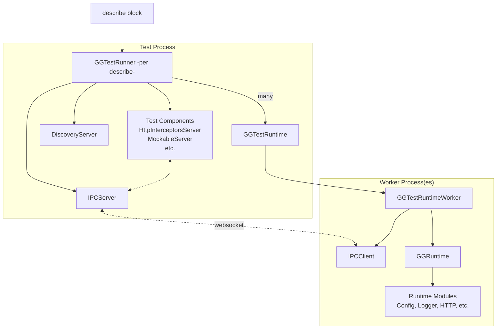
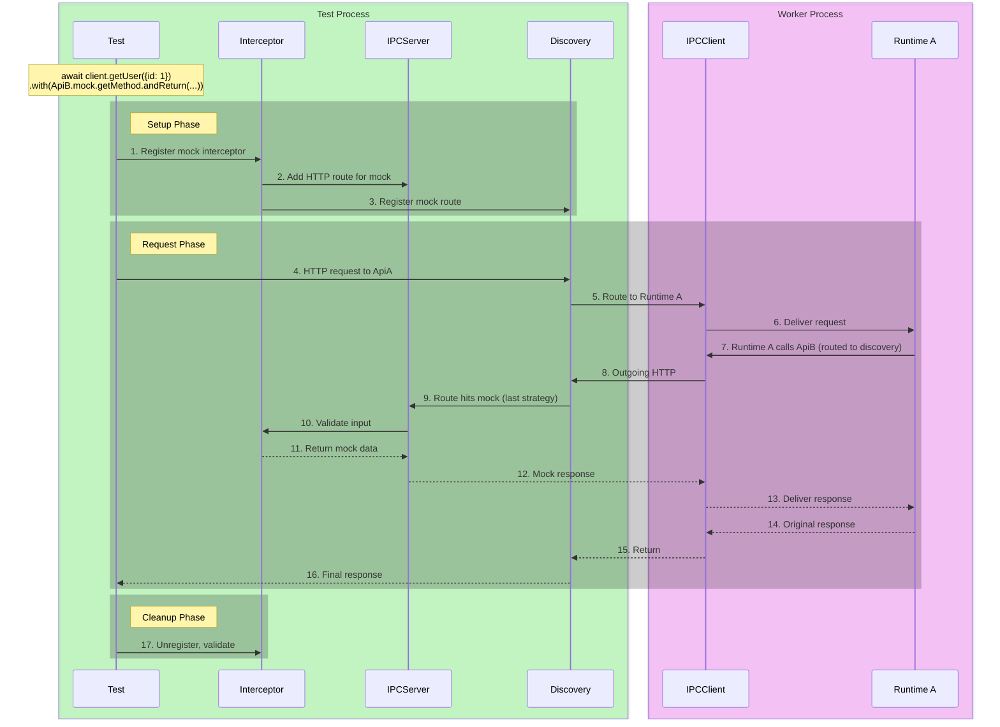

# Testkit

## Architecture Overview

The testkit provides infrastructure for testing GG runtimes with full isolation and interception capabilities.

## Example packages to learn from

Going from scratch into extending the testkit is not trivial, but it is best to start learning from existing packages. It is actually much easier than it looks initially!

Recommended way to start

* Make sure you are familiar with the testkit - have written some tests
* Design the way you want your new package to be tested - is it:
    * "action" (http request) based - check @grest-ts/http, @grest-ts/testkit/mockable.
    * "side effect" based (logging, metrics) - check @grest-ts/logger, @grest-ts/config
* All testkit code is extension to the package, core should not be aware it is being tested. All packages that have testkit customizations should have a testkit folder that defines how testkit is
  extended.

But lets get serious now - just ask AI to understand these docs and look at existing packages and let it write the extension for you!

### Main Players

| Class                 | Role                                                                                                                                                                                                            |
|-----------------------|-----------------------------------------------------------------------------------------------------------------------------------------------------------------------------------------------------------------|
| `GGTest`              | Static API for test files. Entry point for starting runtimes.                                                                                                                                                   |
| `GGTestRunner`        | Test orchestrator (one per describe block). Manages runtimes, IPC server, components, hooks.                                                                                                                    |
| `GGTestRuntime`       | Represents a runtime instance in the test. Wraps a `RuntimeRunner`. (but does not run the runtime)                                                                                                              |
| `GGTestRuntimeWorker` | Runs inside worker/isolated process. Connects back to test via IPC.                                                                                                                                             |
| `GGTestComponent`     | Server-side component (e.g., `GGHttpInterceptorsServer`). Handles worker→test communication.                                                                                                                    |
| `GGTestSelector`      | Provides `t.myRuntime.xxx` syntax for accessing runtime extensions.                                                                                                                                             |
| `IPC`                 | IPC is an internal communications channel between test and workers. It is also used for all local development. <br /> Notice that most requests locally go through IPC, not directly from serviceA to serviceB. |

### Run Modes

| Mode       | Description                          | Use Case                              |
|------------|--------------------------------------|---------------------------------------|
| `INLINE`   | Runtime runs in same process as test | Debugging, coverage collection        |
| `WORKER`   | Runtime runs in worker_thread        | Default. Good isolation, fast startup |
| `ISOLATED` | Runtime runs in child_process        | Full process isolation, CLI testing   |

```typescript
const t = GGTest.startInline(MyRuntime);   // Same process
const t = GGTest.startWorker(MyRuntime);   // Worker thread (default)
const t = GGTest.startIsolated(MyRuntime); // Child process
```

### Architecture Diagram



### Request Flow with Interception

When a test makes an HTTP call with `.with()` expectations:



**Mock vs Spy:**

- **Mock**: Intercepts call, returns fake data. Real service never called.
- **Spy**: Intercepts call, validates input, calls real service, validates response.

---

# Testkit Extensions

Packages extend testkit by creating a `testkit/index-testkit.ts` file. These files are **auto-discovered** by `GGTestkitExtensionsDiscovery` at test startup - no manual imports needed.

## Auto-Discovery

Discovery scans for `testkit/index-testkit.ts` in:

- `node_modules/@*/*/testkit/index-testkit.ts`
- `node_modules/*/testkit/index-testkit.ts`
- `packages/*/testkit/index-testkit.ts` (monorepo)

Extensions self-register via side effects when imported (e.g., `GGTestSelector.addExtension()`, `GGTestRunner.registerComponent()`).

---

## Overall philosophy of the testkit and its extensions

Overall, testkit overwrites how runtime modules behave. For example:

* You might want to override how Config is loaded, instead of loading it from a file, we load it via "TestConfigLoader" that test has access to.
* Queues might publish to test instead of actual queue
* Http requests might actually be forwarded to the test, instead of another service. Test could proxy those to the intended service later.

These overrides are usually done by brutally overwriting prototype methods with custom implementations.
This keeps runtime code very clean from any test-related functionality, but when running in testkit, things change.
Don't forget, we don't test the framework here, we test user business code.

**We do not need to ensure within these tests that framework implementations of different libraries work!**


---

# Part 1: Communication (Test ↔ Worker)

Tests run in a main process, while runtimes run in worker processes.
This section covers how they communicate. Notice that this should be the mental model, but in reality there are multiple run modes, one being inline where each Runtime runs in the same process.

IMPORTANT! Runtimes should not use static state.
All state should be locked in an async context! This is in general a good pattern to have.

## 1.1 (Test → Worker) Requests

Register IPC handlers that execute inside worker processes. Define type-safe IPC requests and register handlers using `onBeforeRuntimeStart`.

```typescript
import {GGTestRuntimeWorker} from "@grest-ts/testkit";
import {IPCClient} from "@grest-ts/ipc";

// -------------------------------------------------------
// Define type-safe IPC request for the worker
export const GGConfigIPC = {
    worker: {
        update: IPCClient.defineRequest<ConfigUpdatePayload, void>("config.update"),
    }
}

// Register handler - safe at module load time, executed during worker.start()
GGTestRuntimeWorker.onBeforeRuntimeStart(() => {
    const worker = GGTestRuntimeWorker.getCurrent();
    worker.ipcClient.onFrameworkRequest(GGConfigIPC.worker.update, async (payload) => {
        console.log(payload);
    });
});

// -------------------------------------------------------
// USAGE example in the TEST to actually send the message
declare const runtime: GGTestRuntimeWorker
await runtime.sendCommand(GGConfigIPC.worker.update, {storeName, keyName, value});

// Fanout to all instances.
declare const runner: GGTestRunner
await runner.sendCommand(GGConfigIPC.worker.update, {storeName, keyName, value});
```

---

## 1.2 (Worker → Test) Requests

For features needing worker-initiated communication, create a test component that handles messages from workers.

```typescript
// Define type-safe IPC requests
import {IPCServer} from "@grest-ts/ipc";
import {GGTestComponent, GGTestRunner} from "@grest-ts/testkit";

export const MyIPC = {
    server: {
        doSomething: IPCServer.defineRequest<{ data: string }, { result: number }>("my.doSomething"),
    }
}

// -------------------------------------------------------
// Define a TestComponent

export class GGMyTestComponent implements GGTestComponent {
    constructor(runner: GGTestRunner) {
        runner.ipcServer.onFrameworkRequest(MyIPC.server.doSomething, async (payload) => {
            // Process message from worker...
            return {result: 42};
        });
    }
}

// Register component with the runner. This is initialized once per describe block.
GGTestRunner.registerComponent(GGMyTestComponent);


// -------------------------------------------------------
// In worker: send message to test server
const worker = GGTestRuntimeWorker.getCurrent();
const response = await worker.ipcClient.sendFrameworkRequest(MyIPC.server.doSomething, {data: "hello"});
// response.result === 42

```

---

# Part 2: Extending the Test API

This section covers how to add new properties and methods to the test API surface.

## 2.1 Selector Extensions

Selectors provide convenient access to all the runtimes that have been started.

```typescript
const t = GGTest.startInline(ServiceA, ServiceA, ServiceB);

t.serviceA.something.do() // runs doSomething for each ServiceA

t.serviceA[0].something.do() // runs doSomething for first serviceA

t.all().something.do() // runs do something for all

t.serviceB.something.do() // runs do something for serviceB

```

Below is an extension that would enable the example above:

```typescript
// packages/config/testkit/GGTestSelectorConfig.ts
import {GGTestSelector, GGTestSelectorExtension, RuntimeConstructor} from "@grest-ts/testkit";

export class GGDoSomethingExtension extends GGTestSelectorExtension {
    public static readonly PROPERTY_NAME = "something";

    public do() {
        console.log("doing something")
    }
}

// Declaration merging for type safety
declare module "@grest-ts/testkit" {
    interface SelectorExtensions<T extends RuntimeConstructor[]> {
        something: GGDoSomethingExtension;
    }
}

// Register the extension
// IMPORTANT: Remember to register the extension!
GGTestSelector.addExtension(GGDoSomethingExtension);

```

---

## 2.2 Schema Extensions / Resource definition extensions

Add properties to schema classes
Examples of schema classes: httpApi, websocketApi, snsRouter and so on.

In essence, these are useful to add mock/spy functionality to resources, enabling typed mock/spy checkers.

```typescript
// Mock - intercept call and return fake data
await client.getUser({id: 1})
    .with(
        // UserApi gets "mock" property that provides powerful way to define mocks.
        UserApi.mock.getUser.andReturn({name: "Alice"})
    );

// Spy - passthrough with request/response validation
await client.createUser({name: "Bob"})
    .with(
        // UserApi gets "spy" property that provides powerful way to define spies.
        UserApi.spy.createUser
            .toMatchObject({name: "Bob"})
            .response.toMatchObject({id: expect.any(String)})
    );

// Routing - control which runtime handles requests
UserApi.routing.random();           // Load balance randomly
UserApi.routing.roundRobin();       // Round-robin distribution
UserApi.routing.sticky("user-123"); // Same user → same runtime
```

Here is an example for httpApi that adds mock property to the API definition for tests.

```typescript
// packages/http/testkit/mock/HttpApiSchema.mock.ts
import {HttpApiSchema} from "../../src/api/httpApiDefinition";
import {GGMockWith} from "@grest-ts/testkit";

// Declaration merging
declare module "../../src/api/httpApiDefinition" {
    interface HttpApiSchema<TApi, TAuthState> {
        readonly mock: { [K in keyof TApi]: GGMockWith };
    }
}

// Add property via prototype
Object.defineProperty(HttpApiSchema.prototype, 'mock', {
    get(this: HttpApiSchema<any, any>) {
        return new Proxy({}, {
            get: (_target, prop: string) => {
                const methodDef = this.__methods[prop];
                return new GGMockWith(GGHttpInterceptor, {
                    method: methodDef.method,
                    pathPrefix: "/" + this.__pathPrefix + "/",
                    pathSuffix: methodDef.path
                });
            }
        });
    }
});
```

---

## 2.3 .with() and .waitFor() extensions

Implement custom `.with()` / `.waitFor()` expectations.

In essence, most await calls are Actions and for each action we can add .with clauses that "check for something".
.with() expects that this thing successfully happened during the action. For example I make call to serviceA and that calls serviceB. Then I could expect serviceB to be called
.waitFor() expects something to happen either during action or shortly after. For example if I return quickly, but still send request to serviceB.

Interceptors are useful helpers that "get some data and validate it".
For example http interceptors would get all http requests that go from service to service and intercept those,
then validate the "input" and if used as mock, return a response. In case of a spy, it would call through and also validate the actual response.

These are usually used when defining custom mock/spy implementations.

```typescript
// .with() - assert something happens during the call
await client.createUser({name: "Alice"})
    .with(
        // logs.expect returns a class that implements IGGTestWith
        t.myRuntime.logs.expect("User created: Alice")
    );

// .waitFor() - wait for async log after call returns
await client.startBackgroundJob()
    .waitFor(
        t.myRuntime.logs.expect("Job completed")
    );

```

```typescript
// packages/logger/testkit/GGLogWith.ts
import {IGGTestWith, IGGTestInterceptor} from "@grest-ts/testkit";

export class GGMyWith implements IGGTestWith {
    constructor(private runtimes: GGTestRuntime[], private matcher: LogMatcher) {
    }

    createInterceptor(): IGGTestInterceptor {
        return new GGMyInterceptor();
    }
}

export class GGMyInterceptor implements IGGTestInterceptor {

    public register(): void {
        // This means action is starting
        // Register interception handling to some central registry
    }

    public unregister(): void {
        // This means action finished
        // Unregister interception handling to some central registry
    }

    public myCustomCalledMethod(data: unknown) {
        // Interceptor was called with this data. Store it for later validation. (or validate now, but store validation result.
    }

    public validate(): void | Promise<void> {
        // Store validation issues, do not throw.
    }

    public getMockValidationError(): Error | undefined {
        // Return an issue for this interceptor.
    }

    public isCalled(): boolean {
        // It is assumed interceptors are called. You should keep track of that.
    }
}
```

---

# Reference

## File Structure

```
packages/mypackage/
  testkit/
    index-testkit.ts          # Entry point (auto-discovered)
    GGMyCommands.ts           # IPC definitions and worker handlers
    GGMyServer.ts             # Test component (worker→test)
    GGMySelector.ts           # Selector extension (t.runtime.my)
    GGMyWith.ts               # IGGTestWith implementation
    GGMyInterceptor.ts        # IGGTestInterceptor implementation
```

## Checklist for New Extensions

1. Create `testkit/index-testkit.ts` as entry point
2. Export all public APIs from index-testkit.ts
3. Use `declare module` for TypeScript type augmentation
4. Register selector extensions with `GGTestSelector.addExtension()`
5. Register worker IPC handlers with `GGTestRuntimeWorker.onBeforeRuntimeStart()`
6. Register test components with `GGTestRunner.registerComponent()`

