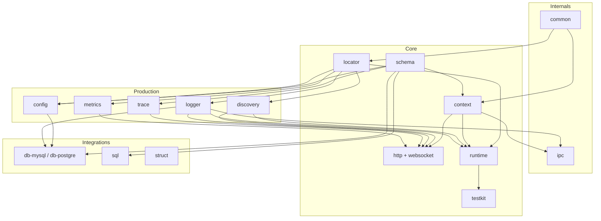

# Packages

grest-ts is organized into four categories. The diagram below shows the major packages and how they depend on each other — arrows point from a dependency to the packages that use it.

### Reading the diagram

- **Internals** sit at the foundation — `common` provides shared utilities and `ipc` handles inter-process communication.
- **Core** packages build the framework skeleton: `schema` defines contracts, `context` and `locator` provide request-scoped state and service wiring, `http`/`websocket` serve traffic, `runtime` bootstraps everything, and `testkit` drives integration tests.
- **Production** packages plug in through `locator` and `context` — configuration, service discovery, logging, tracing, and metrics are all swappable.
- **Integrations** consume core + production to connect to external systems (databases, binary protocols).

---

<!-- GENERATED-PACKAGE-TABLES -->
