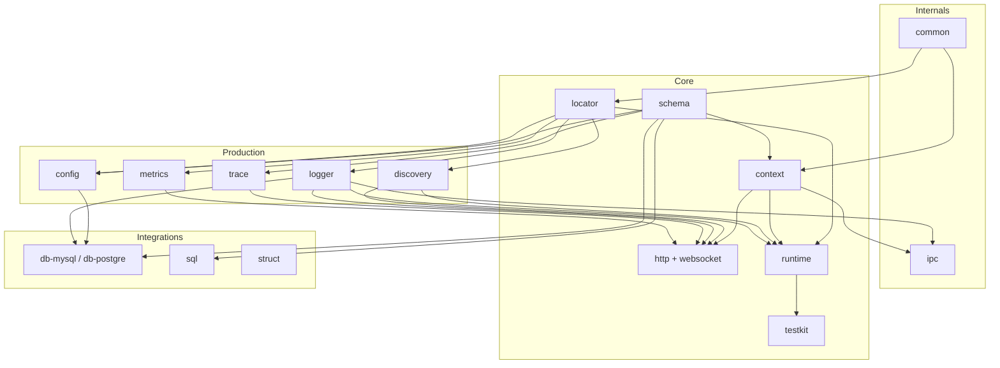

# Packages

grest-ts is organized into four categories. The diagram below shows the major packages and how they depend on each other — arrows point from a dependency to the packages that use it.

### Reading the diagram

- **Internals** sit at the foundation — `common` provides shared utilities and `ipc` handles inter-process communication.
- **Core** packages build the framework skeleton: `schema` defines contracts, `context` and `locator` provide request-scoped state and service wiring, `http`/`websocket` serve traffic, `runtime` bootstraps everything, and `testkit` drives integration tests.
- **Production** packages plug in through `locator` and `context` — configuration, service discovery, logging, tracing, and metrics are all swappable.
- **Integrations** consume core + production to connect to external systems (databases, binary protocols).

---

## Core

The essential framework packages — schema definitions, HTTP/WebSocket transport, service wiring, lifecycle, and testing.

| Package | Description |
|---------|-------------|
| [@grest-ts/schema](/packages/core/schema) | Type-safe schema validation, serialization, and contract definitions |
| [@grest-ts/context](/packages/core/context) | Hierarchical async context for request-scoped data |
| [@grest-ts/locator](/packages/core/locator) | Hierarchical async context with tree-based service location |
| [@grest-ts/http](/packages/core/http) | HTTP server and client library for Node.js and browser |
| [@grest-ts/websocket](/packages/core/websocket) | WebSocket server and client library for Node.js and browser |
| [@grest-ts/runtime](/packages/core/runtime) | Service bootstrap and lifecycle management |
| [@grest-ts/metrics](/packages/core/metrics) | Metrics collection for Grest Framework |
| [@grest-ts/file](/packages/core/file) | File abstraction for Grest framework |
| [@grest-ts/file-http](/packages/core/file-http) | HTTP file download codec |
| [@grest-ts/testkit](/packages/core/testkit) | Integration testing library with isolated runtimes |
| [@grest-ts/testkit-runtime](/packages/core/testkit-runtime) | Testing library runtime internals |
| [@grest-ts/testkit-vitest](/packages/core/testkit-vitest) | Vitest integration for the testing library |
| [@grest-ts/create-starter](/packages/core/create-starter) | Scaffold a new grest-ts project |

## Production

Operational concerns — configuration, service discovery, logging, tracing, and metrics. All plug in through the locator/context system.

| Package | Description |
|---------|-------------|
| [@grest-ts/config](/packages/production/config) | Configuration management — settings, secrets, and resources |
| [@grest-ts/config-aws](/packages/production/config-aws) | AWS Secrets Manager adapter for config |
| [@grest-ts/discovery](/packages/production/discovery) | Service discovery interface |
| [@grest-ts/discovery-local](/packages/production/discovery-local) | Local (single-machine) service discovery |
| [@grest-ts/discovery-static](/packages/production/discovery-static) | Static service discovery from a fixed list |
| [@grest-ts/logger](/packages/production/logger) | Structured logging library |
| [@grest-ts/logger-console](/packages/production/logger-console) | Console logger implementation |
| [@grest-ts/trace](/packages/production/trace) | Distributed tracing support |
| [@grest-ts/trace-http](/packages/production/trace-http) | HTTP header propagation for tracing |

## Integrations

Connectors to external systems — databases and binary protocols.

| Package | Description |
|---------|-------------|
| [@grest-ts/db-mysql](/packages/integrations/db-mysql) | MySQL database utilities |
| [@grest-ts/db-postgre](/packages/integrations/db-postgre) | PostgreSQL database utilities |
| [@grest-ts/sql](/packages/integrations/sql) | Type-safe SQL query builder |
| [@grest-ts/struct](/packages/integrations/struct) | Binary struct definitions with code generation |

## Internals

Low-level utilities shared across the framework. You typically don't import these directly.

| Package | Description |
|---------|-------------|
| [@grest-ts/common](/packages/internals/common) | Shared utility functions and types |
| [@grest-ts/ipc](/packages/internals/ipc) | Inter-process communication library |
