<!-- THIS FILE IS GENERATED - DO NOT EDIT -->

# Package Dependencies

> 🟢 Node.js &nbsp; 🌐 Browser

```mermaid
flowchart TB
    subgraph L0[" "]
        api-docs["api-docs 🟢"]
        asyncapi["asyncapi 🟢"]
        auth["auth 🟢🌐"]
        cli["cli "]
        code-generator["code-generator 🟢"]
        config-aws["config-aws 🟢"]
        create-starter["create-starter "]
        discovery-kubernetes["discovery-kubernetes 🟢"]
        discovery-migration["discovery-migration 🟢"]
        discovery-static["discovery-static 🟢"]
        events-aws["events-aws 🟢"]
        events-azure["events-azure 🟢"]
        events-gcp["events-gcp 🟢"]
        http-file["http-file 🟢🌐"]
        intl["intl 🟢🌐"]
        poller["poller 🟢"]
        schema-benchmark["schema-benchmark 🟢"]
        sql["sql 🟢"]
        struct["struct 🟢"]
        testkit-vitest["testkit-vitest 🟢"]
        trace-http["trace-http 🟢"]
    end
    subgraph L1[" "]
        db-dynamodb["db-dynamodb 🟢"]
        db-mysql["db-mysql 🟢"]
        db-postgre["db-postgre 🟢"]
        events["events 🟢"]
        lock["lock 🟢"]
        openapi["openapi 🟢"]
        testkit["testkit 🟢"]
        websocket["websocket 🟢🌐"]
    end
    subgraph L2[" "]
        config["config 🟢"]
        http["http 🟢🌐"]
        logger-console["logger-console 🟢"]
        runtime["runtime 🟢"]
        testkit-runtime["testkit-runtime 🟢"]
    end
    subgraph L3[" "]
        discovery-local["discovery-local 🟢"]
        metrics["metrics 🟢"]
        schema-file["schema-file 🟢🌐"]
    end
    subgraph L4[" "]
        discovery["discovery 🟢"]
        ipc["ipc 🟢"]
    end
    subgraph L5[" "]
        logger["logger 🟢🌐"]
        trace["trace 🟢🌐"]
    end
    subgraph L6[" "]
        context["context 🟢🌐"]
        locator["locator 🟢"]
    end
    subgraph L7[" "]
        common["common 🟢🌐"]
        schema["schema 🟢🌐"]
    end
    api-docs --> context
    api-docs --> discovery
    api-docs --> http
    api-docs --> locator
    api-docs --> schema
    api-docs --> websocket
    asyncapi --> http
    asyncapi --> locator
    asyncapi --> openapi
    asyncapi --> schema
    asyncapi --> websocket
    auth --> http
    auth --> schema
    code-generator --> common
    code-generator --> http
    config --> common
    config --> locator
    config --> schema
    config-aws --> config
    context --> common
    context --> schema
    db-dynamodb --> config
    db-dynamodb --> locator
    db-dynamodb --> logger
    db-dynamodb --> schema
    db-mysql --> config
    db-mysql --> locator
    db-mysql --> logger
    db-mysql --> schema
    db-postgre --> config
    db-postgre --> locator
    db-postgre --> logger
    db-postgre --> schema
    discovery --> locator
    discovery-kubernetes --> discovery
    discovery-kubernetes --> logger
    discovery-local --> common
    discovery-local --> discovery
    discovery-local --> ipc
    discovery-local --> locator
    discovery-local --> logger
    discovery-local --> schema
    discovery-migration --> discovery
    discovery-migration --> logger
    discovery-static --> discovery
    discovery-static --> logger
    events --> common
    events --> config
    events --> context
    events --> discovery
    events --> locator
    events --> logger
    events --> metrics
    events --> schema
    events --> trace
    events-aws --> config
    events-aws --> events
    events-aws --> logger
    events-aws --> schema
    events-azure --> config
    events-azure --> events
    events-azure --> logger
    events-azure --> schema
    events-gcp --> config
    events-gcp --> events
    events-gcp --> logger
    events-gcp --> schema
    http --> common
    http --> context
    http --> discovery
    http --> locator
    http --> logger
    http --> metrics
    http --> schema
    http --> trace
    http-file --> common
    http-file --> context
    http-file --> http
    http-file --> schema
    intl --> context
    intl --> locator
    intl --> schema
    ipc --> common
    ipc --> context
    ipc --> locator
    ipc --> logger
    ipc --> trace
    locator --> common
    lock --> locator
    logger --> common
    logger --> locator
    logger-console --> logger
    logger-console --> schema
    logger-console --> schema-file
    metrics --> common
    metrics --> locator
    openapi --> context
    openapi --> http
    openapi --> locator
    openapi --> schema
    poller --> config
    poller --> locator
    poller --> lock
    poller --> metrics
    poller --> schema
    runtime --> common
    runtime --> context
    runtime --> discovery
    runtime --> discovery-local
    runtime --> locator
    runtime --> logger
    runtime --> metrics
    runtime --> trace
    schema-benchmark --> common
    schema-benchmark --> schema
    schema-file --> schema
    sql --> common
    sql --> schema
    testkit --> common
    testkit --> context
    testkit --> ipc
    testkit --> locator
    testkit --> logger
    testkit --> logger-console
    testkit --> runtime
    testkit --> schema
    testkit --> testkit-runtime
    testkit --> trace
    testkit-runtime --> locator
    testkit-vitest --> common
    testkit-vitest --> config
    testkit-vitest --> db-dynamodb
    testkit-vitest --> db-mysql
    testkit-vitest --> db-postgre
    testkit-vitest --> discovery
    testkit-vitest --> discovery-local
    testkit-vitest --> http
    testkit-vitest --> ipc
    testkit-vitest --> locator
    testkit-vitest --> logger
    testkit-vitest --> logger-console
    testkit-vitest --> metrics
    testkit-vitest --> schema-file
    testkit-vitest --> testkit
    testkit-vitest --> websocket
    trace --> context
    trace --> schema
    trace-http --> context
    trace-http --> schema
    trace-http --> trace
    websocket --> common
    websocket --> context
    websocket --> discovery
    websocket --> http
    websocket --> locator
    websocket --> logger
    websocket --> metrics
    websocket --> schema
    websocket --> trace
    style api-docs fill:#4E79A7,stroke:#4E79A7,color:#fff
    style asyncapi fill:#F28E2B,stroke:#F28E2B,color:#fff
    style auth fill:#E15759,stroke:#E15759,color:#fff
    style cli fill:#76B7B2,stroke:#76B7B2,color:#fff
    style code-generator fill:#59A14F,stroke:#59A14F,color:#fff
    style common fill:#EDC948,stroke:#EDC948,color:#fff
    style config fill:#B07AA1,stroke:#B07AA1,color:#fff
    style config-aws fill:#FF9DA7,stroke:#FF9DA7,color:#fff
    style context fill:#9C755F,stroke:#9C755F,color:#fff
    style create-starter fill:#BAB0AC,stroke:#BAB0AC,color:#fff
    style db-dynamodb fill:#86BCB6,stroke:#86BCB6,color:#fff
    style db-mysql fill:#8CD17D,stroke:#8CD17D,color:#fff
    style db-postgre fill:#B6992D,stroke:#B6992D,color:#fff
    style discovery fill:#499894,stroke:#499894,color:#fff
    style discovery-kubernetes fill:#D37295,stroke:#D37295,color:#fff
    style discovery-local fill:#A0CBE8,stroke:#A0CBE8,color:#fff
    style discovery-migration fill:#FFBE7D,stroke:#FFBE7D,color:#fff
    style discovery-static fill:#D4A6C8,stroke:#D4A6C8,color:#fff
    style events fill:#4E79A7,stroke:#4E79A7,color:#fff
    style events-aws fill:#F28E2B,stroke:#F28E2B,color:#fff
    style events-azure fill:#E15759,stroke:#E15759,color:#fff
    style events-gcp fill:#76B7B2,stroke:#76B7B2,color:#fff
    style http fill:#59A14F,stroke:#59A14F,color:#fff
    style http-file fill:#EDC948,stroke:#EDC948,color:#fff
    style intl fill:#B07AA1,stroke:#B07AA1,color:#fff
    style ipc fill:#FF9DA7,stroke:#FF9DA7,color:#fff
    style locator fill:#9C755F,stroke:#9C755F,color:#fff
    style lock fill:#BAB0AC,stroke:#BAB0AC,color:#fff
    style logger fill:#86BCB6,stroke:#86BCB6,color:#fff
    style logger-console fill:#8CD17D,stroke:#8CD17D,color:#fff
    style metrics fill:#B6992D,stroke:#B6992D,color:#fff
    style openapi fill:#499894,stroke:#499894,color:#fff
    style poller fill:#D37295,stroke:#D37295,color:#fff
    style runtime fill:#A0CBE8,stroke:#A0CBE8,color:#fff
    style schema fill:#FFBE7D,stroke:#FFBE7D,color:#fff
    style schema-benchmark fill:#D4A6C8,stroke:#D4A6C8,color:#fff
    style schema-file fill:#4E79A7,stroke:#4E79A7,color:#fff
    style sql fill:#F28E2B,stroke:#F28E2B,color:#fff
    style struct fill:#E15759,stroke:#E15759,color:#fff
    style testkit fill:#76B7B2,stroke:#76B7B2,color:#fff
    style testkit-runtime fill:#59A14F,stroke:#59A14F,color:#fff
    style testkit-vitest fill:#EDC948,stroke:#EDC948,color:#fff
    style trace fill:#B07AA1,stroke:#B07AA1,color:#fff
    style trace-http fill:#FF9DA7,stroke:#FF9DA7,color:#fff
    style websocket fill:#9C755F,stroke:#9C755F,color:#fff
    linkStyle 0 stroke:#4E79A7,stroke-width:2px
    linkStyle 1 stroke:#4E79A7,stroke-width:2px
    linkStyle 2 stroke:#4E79A7,stroke-width:2px
    linkStyle 3 stroke:#4E79A7,stroke-width:2px
    linkStyle 4 stroke:#4E79A7,stroke-width:2px
    linkStyle 5 stroke:#4E79A7,stroke-width:2px
    linkStyle 6 stroke:#F28E2B,stroke-width:2px
    linkStyle 7 stroke:#F28E2B,stroke-width:2px
    linkStyle 8 stroke:#F28E2B,stroke-width:2px
    linkStyle 9 stroke:#F28E2B,stroke-width:2px
    linkStyle 10 stroke:#F28E2B,stroke-width:2px
    linkStyle 11 stroke:#E15759,stroke-width:2px
    linkStyle 12 stroke:#E15759,stroke-width:2px
    linkStyle 13 stroke:#59A14F,stroke-width:2px
    linkStyle 14 stroke:#59A14F,stroke-width:2px
    linkStyle 15 stroke:#B07AA1,stroke-width:2px
    linkStyle 16 stroke:#B07AA1,stroke-width:2px
    linkStyle 17 stroke:#B07AA1,stroke-width:2px
    linkStyle 18 stroke:#FF9DA7,stroke-width:2px
    linkStyle 19 stroke:#9C755F,stroke-width:2px
    linkStyle 20 stroke:#9C755F,stroke-width:2px
    linkStyle 21 stroke:#86BCB6,stroke-width:2px
    linkStyle 22 stroke:#86BCB6,stroke-width:2px
    linkStyle 23 stroke:#86BCB6,stroke-width:2px
    linkStyle 24 stroke:#86BCB6,stroke-width:2px
    linkStyle 25 stroke:#8CD17D,stroke-width:2px
    linkStyle 26 stroke:#8CD17D,stroke-width:2px
    linkStyle 27 stroke:#8CD17D,stroke-width:2px
    linkStyle 28 stroke:#8CD17D,stroke-width:2px
    linkStyle 29 stroke:#B6992D,stroke-width:2px
    linkStyle 30 stroke:#B6992D,stroke-width:2px
    linkStyle 31 stroke:#B6992D,stroke-width:2px
    linkStyle 32 stroke:#B6992D,stroke-width:2px
    linkStyle 33 stroke:#499894,stroke-width:2px
    linkStyle 34 stroke:#D37295,stroke-width:2px
    linkStyle 35 stroke:#D37295,stroke-width:2px
    linkStyle 36 stroke:#A0CBE8,stroke-width:2px
    linkStyle 37 stroke:#A0CBE8,stroke-width:2px
    linkStyle 38 stroke:#A0CBE8,stroke-width:2px
    linkStyle 39 stroke:#A0CBE8,stroke-width:2px
    linkStyle 40 stroke:#A0CBE8,stroke-width:2px
    linkStyle 41 stroke:#A0CBE8,stroke-width:2px
    linkStyle 42 stroke:#FFBE7D,stroke-width:2px
    linkStyle 43 stroke:#FFBE7D,stroke-width:2px
    linkStyle 44 stroke:#D4A6C8,stroke-width:2px
    linkStyle 45 stroke:#D4A6C8,stroke-width:2px
    linkStyle 46 stroke:#4E79A7,stroke-width:2px
    linkStyle 47 stroke:#4E79A7,stroke-width:2px
    linkStyle 48 stroke:#4E79A7,stroke-width:2px
    linkStyle 49 stroke:#4E79A7,stroke-width:2px
    linkStyle 50 stroke:#4E79A7,stroke-width:2px
    linkStyle 51 stroke:#4E79A7,stroke-width:2px
    linkStyle 52 stroke:#4E79A7,stroke-width:2px
    linkStyle 53 stroke:#4E79A7,stroke-width:2px
    linkStyle 54 stroke:#4E79A7,stroke-width:2px
    linkStyle 55 stroke:#F28E2B,stroke-width:2px
    linkStyle 56 stroke:#F28E2B,stroke-width:2px
    linkStyle 57 stroke:#F28E2B,stroke-width:2px
    linkStyle 58 stroke:#F28E2B,stroke-width:2px
    linkStyle 59 stroke:#E15759,stroke-width:2px
    linkStyle 60 stroke:#E15759,stroke-width:2px
    linkStyle 61 stroke:#E15759,stroke-width:2px
    linkStyle 62 stroke:#E15759,stroke-width:2px
    linkStyle 63 stroke:#76B7B2,stroke-width:2px
    linkStyle 64 stroke:#76B7B2,stroke-width:2px
    linkStyle 65 stroke:#76B7B2,stroke-width:2px
    linkStyle 66 stroke:#76B7B2,stroke-width:2px
    linkStyle 67 stroke:#59A14F,stroke-width:2px
    linkStyle 68 stroke:#59A14F,stroke-width:2px
    linkStyle 69 stroke:#59A14F,stroke-width:2px
    linkStyle 70 stroke:#59A14F,stroke-width:2px
    linkStyle 71 stroke:#59A14F,stroke-width:2px
    linkStyle 72 stroke:#59A14F,stroke-width:2px
    linkStyle 73 stroke:#59A14F,stroke-width:2px
    linkStyle 74 stroke:#59A14F,stroke-width:2px
    linkStyle 75 stroke:#EDC948,stroke-width:2px
    linkStyle 76 stroke:#EDC948,stroke-width:2px
    linkStyle 77 stroke:#EDC948,stroke-width:2px
    linkStyle 78 stroke:#EDC948,stroke-width:2px
    linkStyle 79 stroke:#B07AA1,stroke-width:2px
    linkStyle 80 stroke:#B07AA1,stroke-width:2px
    linkStyle 81 stroke:#B07AA1,stroke-width:2px
    linkStyle 82 stroke:#FF9DA7,stroke-width:2px
    linkStyle 83 stroke:#FF9DA7,stroke-width:2px
    linkStyle 84 stroke:#FF9DA7,stroke-width:2px
    linkStyle 85 stroke:#FF9DA7,stroke-width:2px
    linkStyle 86 stroke:#FF9DA7,stroke-width:2px
    linkStyle 87 stroke:#9C755F,stroke-width:2px
    linkStyle 88 stroke:#BAB0AC,stroke-width:2px
    linkStyle 89 stroke:#86BCB6,stroke-width:2px
    linkStyle 90 stroke:#86BCB6,stroke-width:2px
    linkStyle 91 stroke:#8CD17D,stroke-width:2px
    linkStyle 92 stroke:#8CD17D,stroke-width:2px
    linkStyle 93 stroke:#8CD17D,stroke-width:2px
    linkStyle 94 stroke:#B6992D,stroke-width:2px
    linkStyle 95 stroke:#B6992D,stroke-width:2px
    linkStyle 96 stroke:#499894,stroke-width:2px
    linkStyle 97 stroke:#499894,stroke-width:2px
    linkStyle 98 stroke:#499894,stroke-width:2px
    linkStyle 99 stroke:#499894,stroke-width:2px
    linkStyle 100 stroke:#D37295,stroke-width:2px
    linkStyle 101 stroke:#D37295,stroke-width:2px
    linkStyle 102 stroke:#D37295,stroke-width:2px
    linkStyle 103 stroke:#D37295,stroke-width:2px
    linkStyle 104 stroke:#D37295,stroke-width:2px
    linkStyle 105 stroke:#A0CBE8,stroke-width:2px
    linkStyle 106 stroke:#A0CBE8,stroke-width:2px
    linkStyle 107 stroke:#A0CBE8,stroke-width:2px
    linkStyle 108 stroke:#A0CBE8,stroke-width:2px
    linkStyle 109 stroke:#A0CBE8,stroke-width:2px
    linkStyle 110 stroke:#A0CBE8,stroke-width:2px
    linkStyle 111 stroke:#A0CBE8,stroke-width:2px
    linkStyle 112 stroke:#A0CBE8,stroke-width:2px
    linkStyle 113 stroke:#D4A6C8,stroke-width:2px
    linkStyle 114 stroke:#D4A6C8,stroke-width:2px
    linkStyle 115 stroke:#4E79A7,stroke-width:2px
    linkStyle 116 stroke:#F28E2B,stroke-width:2px
    linkStyle 117 stroke:#F28E2B,stroke-width:2px
    linkStyle 118 stroke:#76B7B2,stroke-width:2px
    linkStyle 119 stroke:#76B7B2,stroke-width:2px
    linkStyle 120 stroke:#76B7B2,stroke-width:2px
    linkStyle 121 stroke:#76B7B2,stroke-width:2px
    linkStyle 122 stroke:#76B7B2,stroke-width:2px
    linkStyle 123 stroke:#76B7B2,stroke-width:2px
    linkStyle 124 stroke:#76B7B2,stroke-width:2px
    linkStyle 125 stroke:#76B7B2,stroke-width:2px
    linkStyle 126 stroke:#76B7B2,stroke-width:2px
    linkStyle 127 stroke:#76B7B2,stroke-width:2px
    linkStyle 128 stroke:#59A14F,stroke-width:2px
    linkStyle 129 stroke:#EDC948,stroke-width:2px
    linkStyle 130 stroke:#EDC948,stroke-width:2px
    linkStyle 131 stroke:#EDC948,stroke-width:2px
    linkStyle 132 stroke:#EDC948,stroke-width:2px
    linkStyle 133 stroke:#EDC948,stroke-width:2px
    linkStyle 134 stroke:#EDC948,stroke-width:2px
    linkStyle 135 stroke:#EDC948,stroke-width:2px
    linkStyle 136 stroke:#EDC948,stroke-width:2px
    linkStyle 137 stroke:#EDC948,stroke-width:2px
    linkStyle 138 stroke:#EDC948,stroke-width:2px
    linkStyle 139 stroke:#EDC948,stroke-width:2px
    linkStyle 140 stroke:#EDC948,stroke-width:2px
    linkStyle 141 stroke:#EDC948,stroke-width:2px
    linkStyle 142 stroke:#EDC948,stroke-width:2px
    linkStyle 143 stroke:#EDC948,stroke-width:2px
    linkStyle 144 stroke:#EDC948,stroke-width:2px
    linkStyle 145 stroke:#B07AA1,stroke-width:2px
    linkStyle 146 stroke:#B07AA1,stroke-width:2px
    linkStyle 147 stroke:#FF9DA7,stroke-width:2px
    linkStyle 148 stroke:#FF9DA7,stroke-width:2px
    linkStyle 149 stroke:#FF9DA7,stroke-width:2px
    linkStyle 150 stroke:#9C755F,stroke-width:2px
    linkStyle 151 stroke:#9C755F,stroke-width:2px
    linkStyle 152 stroke:#9C755F,stroke-width:2px
    linkStyle 153 stroke:#9C755F,stroke-width:2px
    linkStyle 154 stroke:#9C755F,stroke-width:2px
    linkStyle 155 stroke:#9C755F,stroke-width:2px
    linkStyle 156 stroke:#9C755F,stroke-width:2px
    linkStyle 157 stroke:#9C755F,stroke-width:2px
    linkStyle 158 stroke:#9C755F,stroke-width:2px
```

---

## Per-Package Views

### Api Docs

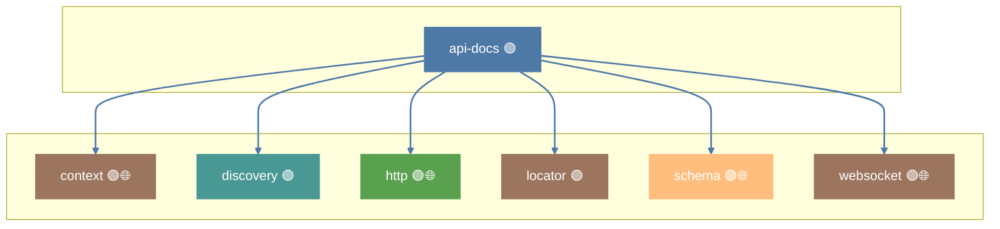

### Asyncapi

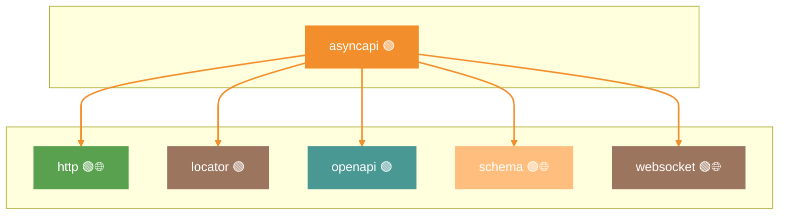

### Auth

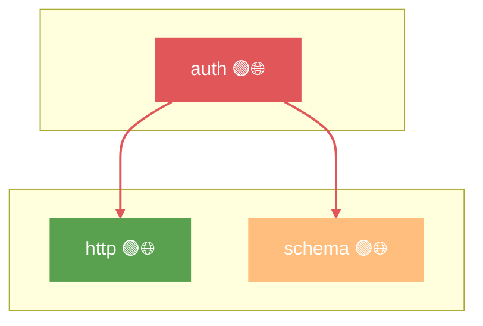

### Cli

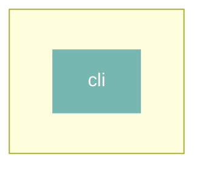

### Code Generator

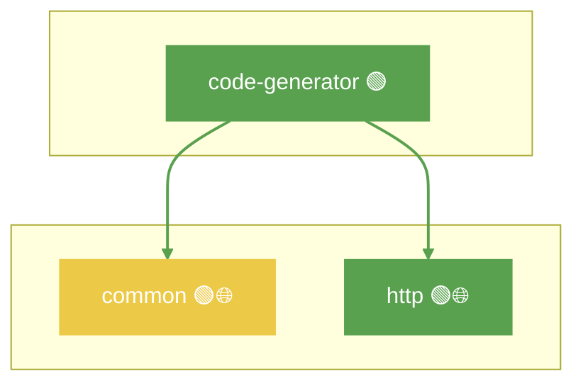

### Common

```mermaid
flowchart TB
    subgraph Dependents[" "]
        code-generator["code-generator 🟢"]
        config["config 🟢"]
        context["context 🟢🌐"]
        discovery-local["discovery-local 🟢"]
        events["events 🟢"]
        http["http 🟢🌐"]
        http-file["http-file 🟢🌐"]
        ipc["ipc 🟢"]
        locator["locator 🟢"]
        logger["logger 🟢🌐"]
        metrics["metrics 🟢"]
        runtime["runtime 🟢"]
        schema-benchmark["schema-benchmark 🟢"]
        sql["sql 🟢"]
        testkit["testkit 🟢"]
        testkit-vitest["testkit-vitest 🟢"]
        websocket["websocket 🟢🌐"]
    end
    subgraph Package[" "]
        common["common 🟢🌐"]
    end
    code-generator --> common
    config --> common
    context --> common
    discovery-local --> common
    events --> common
    http --> common
    http-file --> common
    ipc --> common
    locator --> common
    logger --> common
    metrics --> common
    runtime --> common
    schema-benchmark --> common
    sql --> common
    testkit --> common
    testkit-vitest --> common
    websocket --> common
    style common fill:#EDC948,stroke:#EDC948,color:#fff
    style code-generator fill:#59A14F,stroke:#59A14F,color:#fff
    style config fill:#B07AA1,stroke:#B07AA1,color:#fff
    style context fill:#9C755F,stroke:#9C755F,color:#fff
    style discovery-local fill:#A0CBE8,stroke:#A0CBE8,color:#fff
    style events fill:#4E79A7,stroke:#4E79A7,color:#fff
    style http fill:#59A14F,stroke:#59A14F,color:#fff
    style http-file fill:#EDC948,stroke:#EDC948,color:#fff
    style ipc fill:#FF9DA7,stroke:#FF9DA7,color:#fff
    style locator fill:#9C755F,stroke:#9C755F,color:#fff
    style logger fill:#86BCB6,stroke:#86BCB6,color:#fff
    style metrics fill:#B6992D,stroke:#B6992D,color:#fff
    style runtime fill:#A0CBE8,stroke:#A0CBE8,color:#fff
    style schema-benchmark fill:#D4A6C8,stroke:#D4A6C8,color:#fff
    style sql fill:#F28E2B,stroke:#F28E2B,color:#fff
    style testkit fill:#76B7B2,stroke:#76B7B2,color:#fff
    style testkit-vitest fill:#EDC948,stroke:#EDC948,color:#fff
    style websocket fill:#9C755F,stroke:#9C755F,color:#fff
    linkStyle 0 stroke:#59A14F,stroke-width:2px
    linkStyle 1 stroke:#B07AA1,stroke-width:2px
    linkStyle 2 stroke:#9C755F,stroke-width:2px
    linkStyle 3 stroke:#A0CBE8,stroke-width:2px
    linkStyle 4 stroke:#4E79A7,stroke-width:2px
    linkStyle 5 stroke:#59A14F,stroke-width:2px
    linkStyle 6 stroke:#EDC948,stroke-width:2px
    linkStyle 7 stroke:#FF9DA7,stroke-width:2px
    linkStyle 8 stroke:#9C755F,stroke-width:2px
    linkStyle 9 stroke:#86BCB6,stroke-width:2px
    linkStyle 10 stroke:#B6992D,stroke-width:2px
    linkStyle 11 stroke:#A0CBE8,stroke-width:2px
    linkStyle 12 stroke:#D4A6C8,stroke-width:2px
    linkStyle 13 stroke:#F28E2B,stroke-width:2px
    linkStyle 14 stroke:#76B7B2,stroke-width:2px
    linkStyle 15 stroke:#EDC948,stroke-width:2px
    linkStyle 16 stroke:#9C755F,stroke-width:2px
```

### Config

```mermaid
flowchart TB
    subgraph Dependents[" "]
        config-aws["config-aws 🟢"]
        db-dynamodb["db-dynamodb 🟢"]
        db-mysql["db-mysql 🟢"]
        db-postgre["db-postgre 🟢"]
        events["events 🟢"]
        events-aws["events-aws 🟢"]
        events-azure["events-azure 🟢"]
        events-gcp["events-gcp 🟢"]
        poller["poller 🟢"]
        testkit-vitest["testkit-vitest 🟢"]
    end
    subgraph Package[" "]
        config["config 🟢"]
    end
    subgraph Dependencies[" "]
        common["common 🟢🌐"]
        locator["locator 🟢"]
        schema["schema 🟢🌐"]
    end
    config-aws --> config
    db-dynamodb --> config
    db-mysql --> config
    db-postgre --> config
    events --> config
    events-aws --> config
    events-azure --> config
    events-gcp --> config
    poller --> config
    testkit-vitest --> config
    config --> common
    config --> locator
    config --> schema
    style config fill:#B07AA1,stroke:#B07AA1,color:#fff
    style config-aws fill:#FF9DA7,stroke:#FF9DA7,color:#fff
    style db-dynamodb fill:#86BCB6,stroke:#86BCB6,color:#fff
    style db-mysql fill:#8CD17D,stroke:#8CD17D,color:#fff
    style db-postgre fill:#B6992D,stroke:#B6992D,color:#fff
    style events fill:#4E79A7,stroke:#4E79A7,color:#fff
    style events-aws fill:#F28E2B,stroke:#F28E2B,color:#fff
    style events-azure fill:#E15759,stroke:#E15759,color:#fff
    style events-gcp fill:#76B7B2,stroke:#76B7B2,color:#fff
    style poller fill:#D37295,stroke:#D37295,color:#fff
    style testkit-vitest fill:#EDC948,stroke:#EDC948,color:#fff
    style common fill:#EDC948,stroke:#EDC948,color:#fff
    style locator fill:#9C755F,stroke:#9C755F,color:#fff
    style schema fill:#FFBE7D,stroke:#FFBE7D,color:#fff
    linkStyle 0 stroke:#FF9DA7,stroke-width:2px
    linkStyle 1 stroke:#86BCB6,stroke-width:2px
    linkStyle 2 stroke:#8CD17D,stroke-width:2px
    linkStyle 3 stroke:#B6992D,stroke-width:2px
    linkStyle 4 stroke:#4E79A7,stroke-width:2px
    linkStyle 5 stroke:#F28E2B,stroke-width:2px
    linkStyle 6 stroke:#E15759,stroke-width:2px
    linkStyle 7 stroke:#76B7B2,stroke-width:2px
    linkStyle 8 stroke:#D37295,stroke-width:2px
    linkStyle 9 stroke:#EDC948,stroke-width:2px
    linkStyle 10 stroke:#B07AA1,stroke-width:2px
    linkStyle 11 stroke:#B07AA1,stroke-width:2px
    linkStyle 12 stroke:#B07AA1,stroke-width:2px
```

### Config Aws

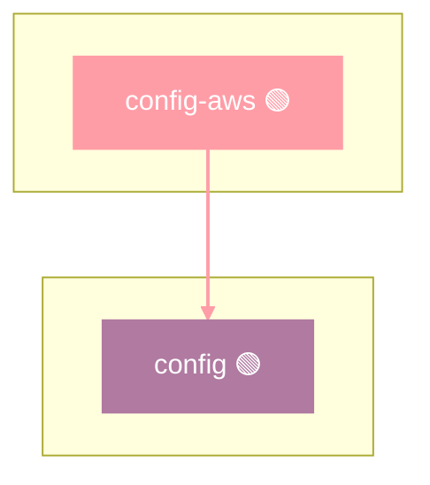

### Context

```mermaid
flowchart TB
    subgraph Dependents[" "]
        api-docs["api-docs 🟢"]
        events["events 🟢"]
        http["http 🟢🌐"]
        http-file["http-file 🟢🌐"]
        intl["intl 🟢🌐"]
        ipc["ipc 🟢"]
        openapi["openapi 🟢"]
        runtime["runtime 🟢"]
        testkit["testkit 🟢"]
        trace["trace 🟢🌐"]
        trace-http["trace-http 🟢"]
        websocket["websocket 🟢🌐"]
    end
    subgraph Package[" "]
        context["context 🟢🌐"]
    end
    subgraph Dependencies[" "]
        common["common 🟢🌐"]
        schema["schema 🟢🌐"]
    end
    api-docs --> context
    events --> context
    http --> context
    http-file --> context
    intl --> context
    ipc --> context
    openapi --> context
    runtime --> context
    testkit --> context
    trace --> context
    trace-http --> context
    websocket --> context
    context --> common
    context --> schema
    style context fill:#9C755F,stroke:#9C755F,color:#fff
    style api-docs fill:#4E79A7,stroke:#4E79A7,color:#fff
    style events fill:#4E79A7,stroke:#4E79A7,color:#fff
    style http fill:#59A14F,stroke:#59A14F,color:#fff
    style http-file fill:#EDC948,stroke:#EDC948,color:#fff
    style intl fill:#B07AA1,stroke:#B07AA1,color:#fff
    style ipc fill:#FF9DA7,stroke:#FF9DA7,color:#fff
    style openapi fill:#499894,stroke:#499894,color:#fff
    style runtime fill:#A0CBE8,stroke:#A0CBE8,color:#fff
    style testkit fill:#76B7B2,stroke:#76B7B2,color:#fff
    style trace fill:#B07AA1,stroke:#B07AA1,color:#fff
    style trace-http fill:#FF9DA7,stroke:#FF9DA7,color:#fff
    style websocket fill:#9C755F,stroke:#9C755F,color:#fff
    style common fill:#EDC948,stroke:#EDC948,color:#fff
    style schema fill:#FFBE7D,stroke:#FFBE7D,color:#fff
    linkStyle 0 stroke:#4E79A7,stroke-width:2px
    linkStyle 1 stroke:#4E79A7,stroke-width:2px
    linkStyle 2 stroke:#59A14F,stroke-width:2px
    linkStyle 3 stroke:#EDC948,stroke-width:2px
    linkStyle 4 stroke:#B07AA1,stroke-width:2px
    linkStyle 5 stroke:#FF9DA7,stroke-width:2px
    linkStyle 6 stroke:#499894,stroke-width:2px
    linkStyle 7 stroke:#A0CBE8,stroke-width:2px
    linkStyle 8 stroke:#76B7B2,stroke-width:2px
    linkStyle 9 stroke:#B07AA1,stroke-width:2px
    linkStyle 10 stroke:#FF9DA7,stroke-width:2px
    linkStyle 11 stroke:#9C755F,stroke-width:2px
    linkStyle 12 stroke:#9C755F,stroke-width:2px
    linkStyle 13 stroke:#9C755F,stroke-width:2px
```

### Create Starter

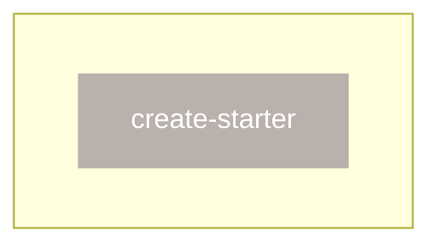

### Db Dynamodb

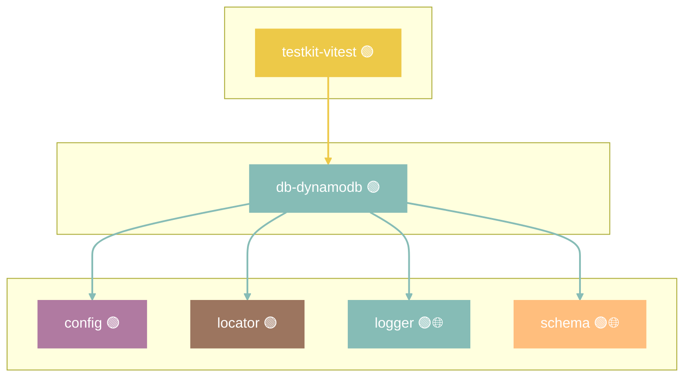

### Db Mysql

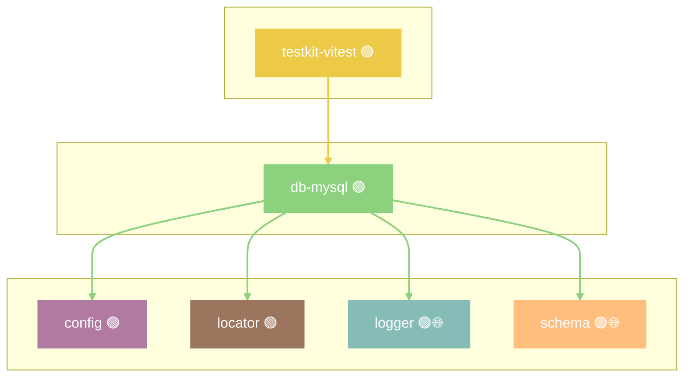

### Db Postgre

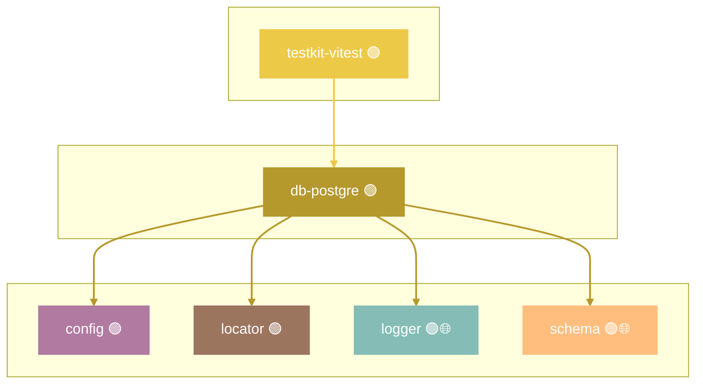

### Discovery

```mermaid
flowchart TB
    subgraph Dependents[" "]
        api-docs["api-docs 🟢"]
        discovery-kubernetes["discovery-kubernetes 🟢"]
        discovery-local["discovery-local 🟢"]
        discovery-migration["discovery-migration 🟢"]
        discovery-static["discovery-static 🟢"]
        events["events 🟢"]
        http["http 🟢🌐"]
        runtime["runtime 🟢"]
        testkit-vitest["testkit-vitest 🟢"]
        websocket["websocket 🟢🌐"]
    end
    subgraph Package[" "]
        discovery["discovery 🟢"]
    end
    subgraph Dependencies[" "]
        locator["locator 🟢"]
    end
    api-docs --> discovery
    discovery-kubernetes --> discovery
    discovery-local --> discovery
    discovery-migration --> discovery
    discovery-static --> discovery
    events --> discovery
    http --> discovery
    runtime --> discovery
    testkit-vitest --> discovery
    websocket --> discovery
    discovery --> locator
    style discovery fill:#499894,stroke:#499894,color:#fff
    style api-docs fill:#4E79A7,stroke:#4E79A7,color:#fff
    style discovery-kubernetes fill:#D37295,stroke:#D37295,color:#fff
    style discovery-local fill:#A0CBE8,stroke:#A0CBE8,color:#fff
    style discovery-migration fill:#FFBE7D,stroke:#FFBE7D,color:#fff
    style discovery-static fill:#D4A6C8,stroke:#D4A6C8,color:#fff
    style events fill:#4E79A7,stroke:#4E79A7,color:#fff
    style http fill:#59A14F,stroke:#59A14F,color:#fff
    style runtime fill:#A0CBE8,stroke:#A0CBE8,color:#fff
    style testkit-vitest fill:#EDC948,stroke:#EDC948,color:#fff
    style websocket fill:#9C755F,stroke:#9C755F,color:#fff
    style locator fill:#9C755F,stroke:#9C755F,color:#fff
    linkStyle 0 stroke:#4E79A7,stroke-width:2px
    linkStyle 1 stroke:#D37295,stroke-width:2px
    linkStyle 2 stroke:#A0CBE8,stroke-width:2px
    linkStyle 3 stroke:#FFBE7D,stroke-width:2px
    linkStyle 4 stroke:#D4A6C8,stroke-width:2px
    linkStyle 5 stroke:#4E79A7,stroke-width:2px
    linkStyle 6 stroke:#59A14F,stroke-width:2px
    linkStyle 7 stroke:#A0CBE8,stroke-width:2px
    linkStyle 8 stroke:#EDC948,stroke-width:2px
    linkStyle 9 stroke:#9C755F,stroke-width:2px
    linkStyle 10 stroke:#499894,stroke-width:2px
```

### Discovery Kubernetes

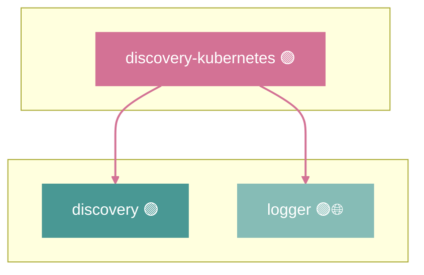

### Discovery Local

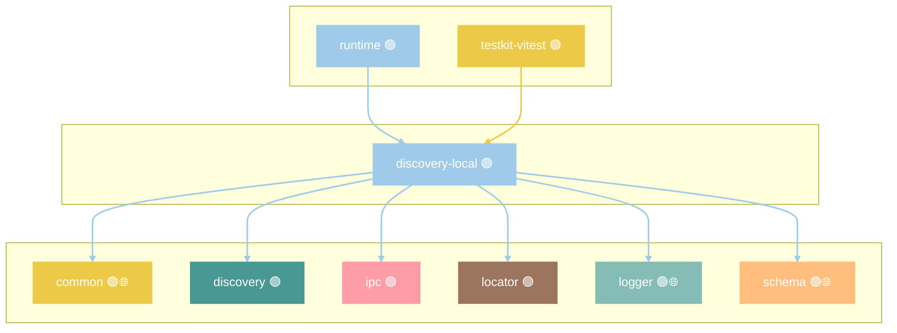

### Discovery Migration

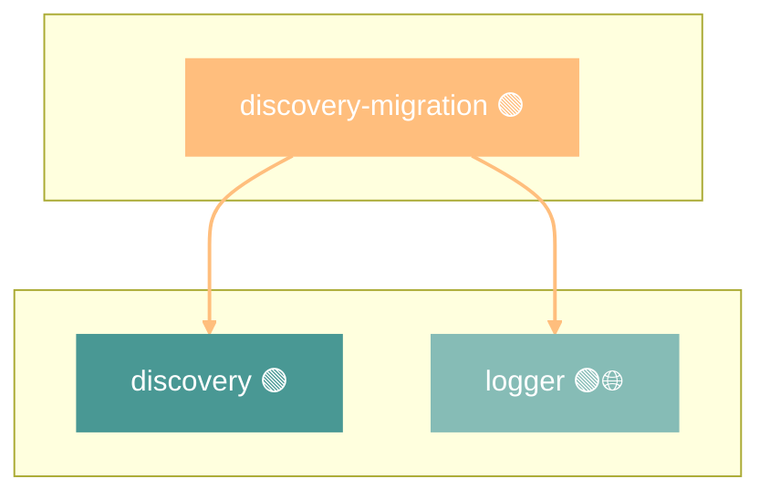

### Discovery Static


### Events

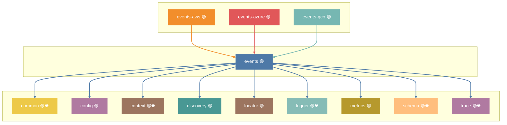

### Events Aws

```mermaid
flowchart TB
    subgraph Package[" "]
        events-aws["events-aws 🟢"]
    end
    subgraph Dependencies[" "]
        config["config 🟢"]
        events["events 🟢"]
        logger["logger 🟢🌐"]
        schema["schema 🟢🌐"]
    end
    events-aws --> config
    events-aws --> events
    events-aws --> logger
    events-aws --> schema
    style events-aws fill:#F28E2B,stroke:#F28E2B,color:#fff
    style config fill:#B07AA1,stroke:#B07AA1,color:#fff
    style events fill:#4E79A7,stroke:#4E79A7,color:#fff
    style logger fill:#86BCB6,stroke:#86BCB6,color:#fff
    style schema fill:#FFBE7D,stroke:#FFBE7D,color:#fff
    linkStyle 0 stroke:#F28E2B,stroke-width:2px
    linkStyle 1 stroke:#F28E2B,stroke-width:2px
    linkStyle 2 stroke:#F28E2B,stroke-width:2px
    linkStyle 3 stroke:#F28E2B,stroke-width:2px
```

### Events Azure

```mermaid
flowchart TB
    subgraph Package[" "]
        events-azure["events-azure 🟢"]
    end
    subgraph Dependencies[" "]
        config["config 🟢"]
        events["events 🟢"]
        logger["logger 🟢🌐"]
        schema["schema 🟢🌐"]
    end
    events-azure --> config
    events-azure --> events
    events-azure --> logger
    events-azure --> schema
    style events-azure fill:#E15759,stroke:#E15759,color:#fff
    style config fill:#B07AA1,stroke:#B07AA1,color:#fff
    style events fill:#4E79A7,stroke:#4E79A7,color:#fff
    style logger fill:#86BCB6,stroke:#86BCB6,color:#fff
    style schema fill:#FFBE7D,stroke:#FFBE7D,color:#fff
    linkStyle 0 stroke:#E15759,stroke-width:2px
    linkStyle 1 stroke:#E15759,stroke-width:2px
    linkStyle 2 stroke:#E15759,stroke-width:2px
    linkStyle 3 stroke:#E15759,stroke-width:2px
```

### Events Gcp

```mermaid
flowchart TB
    subgraph Package[" "]
        events-gcp["events-gcp 🟢"]
    end
    subgraph Dependencies[" "]
        config["config 🟢"]
        events["events 🟢"]
        logger["logger 🟢🌐"]
        schema["schema 🟢🌐"]
    end
    events-gcp --> config
    events-gcp --> events
    events-gcp --> logger
    events-gcp --> schema
    style events-gcp fill:#76B7B2,stroke:#76B7B2,color:#fff
    style config fill:#B07AA1,stroke:#B07AA1,color:#fff
    style events fill:#4E79A7,stroke:#4E79A7,color:#fff
    style logger fill:#86BCB6,stroke:#86BCB6,color:#fff
    style schema fill:#FFBE7D,stroke:#FFBE7D,color:#fff
    linkStyle 0 stroke:#76B7B2,stroke-width:2px
    linkStyle 1 stroke:#76B7B2,stroke-width:2px
    linkStyle 2 stroke:#76B7B2,stroke-width:2px
    linkStyle 3 stroke:#76B7B2,stroke-width:2px
```

### Http

```mermaid
flowchart TB
    subgraph Dependents[" "]
        api-docs["api-docs 🟢"]
        asyncapi["asyncapi 🟢"]
        auth["auth 🟢🌐"]
        code-generator["code-generator 🟢"]
        http-file["http-file 🟢🌐"]
        openapi["openapi 🟢"]
        testkit-vitest["testkit-vitest 🟢"]
        websocket["websocket 🟢🌐"]
    end
    subgraph Package[" "]
        http["http 🟢🌐"]
    end
    subgraph Dependencies[" "]
        common["common 🟢🌐"]
        context["context 🟢🌐"]
        discovery["discovery 🟢"]
        locator["locator 🟢"]
        logger["logger 🟢🌐"]
        metrics["metrics 🟢"]
        schema["schema 🟢🌐"]
        trace["trace 🟢🌐"]
    end
    api-docs --> http
    asyncapi --> http
    auth --> http
    code-generator --> http
    http-file --> http
    openapi --> http
    testkit-vitest --> http
    websocket --> http
    http --> common
    http --> context
    http --> discovery
    http --> locator
    http --> logger
    http --> metrics
    http --> schema
    http --> trace
    style http fill:#59A14F,stroke:#59A14F,color:#fff
    style api-docs fill:#4E79A7,stroke:#4E79A7,color:#fff
    style asyncapi fill:#F28E2B,stroke:#F28E2B,color:#fff
    style auth fill:#E15759,stroke:#E15759,color:#fff
    style code-generator fill:#59A14F,stroke:#59A14F,color:#fff
    style http-file fill:#EDC948,stroke:#EDC948,color:#fff
    style openapi fill:#499894,stroke:#499894,color:#fff
    style testkit-vitest fill:#EDC948,stroke:#EDC948,color:#fff
    style websocket fill:#9C755F,stroke:#9C755F,color:#fff
    style common fill:#EDC948,stroke:#EDC948,color:#fff
    style context fill:#9C755F,stroke:#9C755F,color:#fff
    style discovery fill:#499894,stroke:#499894,color:#fff
    style locator fill:#9C755F,stroke:#9C755F,color:#fff
    style logger fill:#86BCB6,stroke:#86BCB6,color:#fff
    style metrics fill:#B6992D,stroke:#B6992D,color:#fff
    style schema fill:#FFBE7D,stroke:#FFBE7D,color:#fff
    style trace fill:#B07AA1,stroke:#B07AA1,color:#fff
    linkStyle 0 stroke:#4E79A7,stroke-width:2px
    linkStyle 1 stroke:#F28E2B,stroke-width:2px
    linkStyle 2 stroke:#E15759,stroke-width:2px
    linkStyle 3 stroke:#59A14F,stroke-width:2px
    linkStyle 4 stroke:#EDC948,stroke-width:2px
    linkStyle 5 stroke:#499894,stroke-width:2px
    linkStyle 6 stroke:#EDC948,stroke-width:2px
    linkStyle 7 stroke:#9C755F,stroke-width:2px
    linkStyle 8 stroke:#59A14F,stroke-width:2px
    linkStyle 9 stroke:#59A14F,stroke-width:2px
    linkStyle 10 stroke:#59A14F,stroke-width:2px
    linkStyle 11 stroke:#59A14F,stroke-width:2px
    linkStyle 12 stroke:#59A14F,stroke-width:2px
    linkStyle 13 stroke:#59A14F,stroke-width:2px
    linkStyle 14 stroke:#59A14F,stroke-width:2px
    linkStyle 15 stroke:#59A14F,stroke-width:2px
```

### Http File

```mermaid
flowchart TB
    subgraph Package[" "]
        http-file["http-file 🟢🌐"]
    end
    subgraph Dependencies[" "]
        common["common 🟢🌐"]
        context["context 🟢🌐"]
        http["http 🟢🌐"]
        schema["schema 🟢🌐"]
    end
    http-file --> common
    http-file --> context
    http-file --> http
    http-file --> schema
    style http-file fill:#EDC948,stroke:#EDC948,color:#fff
    style common fill:#EDC948,stroke:#EDC948,color:#fff
    style context fill:#9C755F,stroke:#9C755F,color:#fff
    style http fill:#59A14F,stroke:#59A14F,color:#fff
    style schema fill:#FFBE7D,stroke:#FFBE7D,color:#fff
    linkStyle 0 stroke:#EDC948,stroke-width:2px
    linkStyle 1 stroke:#EDC948,stroke-width:2px
    linkStyle 2 stroke:#EDC948,stroke-width:2px
    linkStyle 3 stroke:#EDC948,stroke-width:2px
```

### Intl

```mermaid
flowchart TB
    subgraph Package[" "]
        intl["intl 🟢🌐"]
    end
    subgraph Dependencies[" "]
        context["context 🟢🌐"]
        locator["locator 🟢"]
        schema["schema 🟢🌐"]
    end
    intl --> context
    intl --> locator
    intl --> schema
    style intl fill:#B07AA1,stroke:#B07AA1,color:#fff
    style context fill:#9C755F,stroke:#9C755F,color:#fff
    style locator fill:#9C755F,stroke:#9C755F,color:#fff
    style schema fill:#FFBE7D,stroke:#FFBE7D,color:#fff
    linkStyle 0 stroke:#B07AA1,stroke-width:2px
    linkStyle 1 stroke:#B07AA1,stroke-width:2px
    linkStyle 2 stroke:#B07AA1,stroke-width:2px
```

### Ipc

```mermaid
flowchart TB
    subgraph Dependents[" "]
        discovery-local["discovery-local 🟢"]
        testkit["testkit 🟢"]
        testkit-vitest["testkit-vitest 🟢"]
    end
    subgraph Package[" "]
        ipc["ipc 🟢"]
    end
    subgraph Dependencies[" "]
        common["common 🟢🌐"]
        context["context 🟢🌐"]
        locator["locator 🟢"]
        logger["logger 🟢🌐"]
        trace["trace 🟢🌐"]
    end
    discovery-local --> ipc
    testkit --> ipc
    testkit-vitest --> ipc
    ipc --> common
    ipc --> context
    ipc --> locator
    ipc --> logger
    ipc --> trace
    style ipc fill:#FF9DA7,stroke:#FF9DA7,color:#fff
    style discovery-local fill:#A0CBE8,stroke:#A0CBE8,color:#fff
    style testkit fill:#76B7B2,stroke:#76B7B2,color:#fff
    style testkit-vitest fill:#EDC948,stroke:#EDC948,color:#fff
    style common fill:#EDC948,stroke:#EDC948,color:#fff
    style context fill:#9C755F,stroke:#9C755F,color:#fff
    style locator fill:#9C755F,stroke:#9C755F,color:#fff
    style logger fill:#86BCB6,stroke:#86BCB6,color:#fff
    style trace fill:#B07AA1,stroke:#B07AA1,color:#fff
    linkStyle 0 stroke:#A0CBE8,stroke-width:2px
    linkStyle 1 stroke:#76B7B2,stroke-width:2px
    linkStyle 2 stroke:#EDC948,stroke-width:2px
    linkStyle 3 stroke:#FF9DA7,stroke-width:2px
    linkStyle 4 stroke:#FF9DA7,stroke-width:2px
    linkStyle 5 stroke:#FF9DA7,stroke-width:2px
    linkStyle 6 stroke:#FF9DA7,stroke-width:2px
    linkStyle 7 stroke:#FF9DA7,stroke-width:2px
```

### Locator

```mermaid
flowchart TB
    subgraph Dependents[" "]
        api-docs["api-docs 🟢"]
        asyncapi["asyncapi 🟢"]
        config["config 🟢"]
        db-dynamodb["db-dynamodb 🟢"]
        db-mysql["db-mysql 🟢"]
        db-postgre["db-postgre 🟢"]
        discovery["discovery 🟢"]
        discovery-local["discovery-local 🟢"]
        events["events 🟢"]
        http["http 🟢🌐"]
        intl["intl 🟢🌐"]
        ipc["ipc 🟢"]
        lock["lock 🟢"]
        logger["logger 🟢🌐"]
        metrics["metrics 🟢"]
        openapi["openapi 🟢"]
        poller["poller 🟢"]
        runtime["runtime 🟢"]
        testkit["testkit 🟢"]
        testkit-runtime["testkit-runtime 🟢"]
        testkit-vitest["testkit-vitest 🟢"]
        websocket["websocket 🟢🌐"]
    end
    subgraph Package[" "]
        locator["locator 🟢"]
    end
    subgraph Dependencies[" "]
        common["common 🟢🌐"]
    end
    api-docs --> locator
    asyncapi --> locator
    config --> locator
    db-dynamodb --> locator
    db-mysql --> locator
    db-postgre --> locator
    discovery --> locator
    discovery-local --> locator
    events --> locator
    http --> locator
    intl --> locator
    ipc --> locator
    lock --> locator
    logger --> locator
    metrics --> locator
    openapi --> locator
    poller --> locator
    runtime --> locator
    testkit --> locator
    testkit-runtime --> locator
    testkit-vitest --> locator
    websocket --> locator
    locator --> common
    style locator fill:#9C755F,stroke:#9C755F,color:#fff
    style api-docs fill:#4E79A7,stroke:#4E79A7,color:#fff
    style asyncapi fill:#F28E2B,stroke:#F28E2B,color:#fff
    style config fill:#B07AA1,stroke:#B07AA1,color:#fff
    style db-dynamodb fill:#86BCB6,stroke:#86BCB6,color:#fff
    style db-mysql fill:#8CD17D,stroke:#8CD17D,color:#fff
    style db-postgre fill:#B6992D,stroke:#B6992D,color:#fff
    style discovery fill:#499894,stroke:#499894,color:#fff
    style discovery-local fill:#A0CBE8,stroke:#A0CBE8,color:#fff
    style events fill:#4E79A7,stroke:#4E79A7,color:#fff
    style http fill:#59A14F,stroke:#59A14F,color:#fff
    style intl fill:#B07AA1,stroke:#B07AA1,color:#fff
    style ipc fill:#FF9DA7,stroke:#FF9DA7,color:#fff
    style lock fill:#BAB0AC,stroke:#BAB0AC,color:#fff
    style logger fill:#86BCB6,stroke:#86BCB6,color:#fff
    style metrics fill:#B6992D,stroke:#B6992D,color:#fff
    style openapi fill:#499894,stroke:#499894,color:#fff
    style poller fill:#D37295,stroke:#D37295,color:#fff
    style runtime fill:#A0CBE8,stroke:#A0CBE8,color:#fff
    style testkit fill:#76B7B2,stroke:#76B7B2,color:#fff
    style testkit-runtime fill:#59A14F,stroke:#59A14F,color:#fff
    style testkit-vitest fill:#EDC948,stroke:#EDC948,color:#fff
    style websocket fill:#9C755F,stroke:#9C755F,color:#fff
    style common fill:#EDC948,stroke:#EDC948,color:#fff
    linkStyle 0 stroke:#4E79A7,stroke-width:2px
    linkStyle 1 stroke:#F28E2B,stroke-width:2px
    linkStyle 2 stroke:#B07AA1,stroke-width:2px
    linkStyle 3 stroke:#86BCB6,stroke-width:2px
    linkStyle 4 stroke:#8CD17D,stroke-width:2px
    linkStyle 5 stroke:#B6992D,stroke-width:2px
    linkStyle 6 stroke:#499894,stroke-width:2px
    linkStyle 7 stroke:#A0CBE8,stroke-width:2px
    linkStyle 8 stroke:#4E79A7,stroke-width:2px
    linkStyle 9 stroke:#59A14F,stroke-width:2px
    linkStyle 10 stroke:#B07AA1,stroke-width:2px
    linkStyle 11 stroke:#FF9DA7,stroke-width:2px
    linkStyle 12 stroke:#BAB0AC,stroke-width:2px
    linkStyle 13 stroke:#86BCB6,stroke-width:2px
    linkStyle 14 stroke:#B6992D,stroke-width:2px
    linkStyle 15 stroke:#499894,stroke-width:2px
    linkStyle 16 stroke:#D37295,stroke-width:2px
    linkStyle 17 stroke:#A0CBE8,stroke-width:2px
    linkStyle 18 stroke:#76B7B2,stroke-width:2px
    linkStyle 19 stroke:#59A14F,stroke-width:2px
    linkStyle 20 stroke:#EDC948,stroke-width:2px
    linkStyle 21 stroke:#9C755F,stroke-width:2px
    linkStyle 22 stroke:#9C755F,stroke-width:2px
```

### Lock

```mermaid
flowchart TB
    subgraph Dependents[" "]
        poller["poller 🟢"]
    end
    subgraph Package[" "]
        lock["lock 🟢"]
    end
    subgraph Dependencies[" "]
        locator["locator 🟢"]
    end
    poller --> lock
    lock --> locator
    style lock fill:#BAB0AC,stroke:#BAB0AC,color:#fff
    style poller fill:#D37295,stroke:#D37295,color:#fff
    style locator fill:#9C755F,stroke:#9C755F,color:#fff
    linkStyle 0 stroke:#D37295,stroke-width:2px
    linkStyle 1 stroke:#BAB0AC,stroke-width:2px
```

### Logger

```mermaid
flowchart TB
    subgraph Dependents[" "]
        db-dynamodb["db-dynamodb 🟢"]
        db-mysql["db-mysql 🟢"]
        db-postgre["db-postgre 🟢"]
        discovery-kubernetes["discovery-kubernetes 🟢"]
        discovery-local["discovery-local 🟢"]
        discovery-migration["discovery-migration 🟢"]
        discovery-static["discovery-static 🟢"]
        events["events 🟢"]
        events-aws["events-aws 🟢"]
        events-azure["events-azure 🟢"]
        events-gcp["events-gcp 🟢"]
        http["http 🟢🌐"]
        ipc["ipc 🟢"]
        logger-console["logger-console 🟢"]
        runtime["runtime 🟢"]
        testkit["testkit 🟢"]
        testkit-vitest["testkit-vitest 🟢"]
        websocket["websocket 🟢🌐"]
    end
    subgraph Package[" "]
        logger["logger 🟢🌐"]
    end
    subgraph Dependencies[" "]
        common["common 🟢🌐"]
        locator["locator 🟢"]
    end
    db-dynamodb --> logger
    db-mysql --> logger
    db-postgre --> logger
    discovery-kubernetes --> logger
    discovery-local --> logger
    discovery-migration --> logger
    discovery-static --> logger
    events --> logger
    events-aws --> logger
    events-azure --> logger
    events-gcp --> logger
    http --> logger
    ipc --> logger
    logger-console --> logger
    runtime --> logger
    testkit --> logger
    testkit-vitest --> logger
    websocket --> logger
    logger --> common
    logger --> locator
    style logger fill:#86BCB6,stroke:#86BCB6,color:#fff
    style db-dynamodb fill:#86BCB6,stroke:#86BCB6,color:#fff
    style db-mysql fill:#8CD17D,stroke:#8CD17D,color:#fff
    style db-postgre fill:#B6992D,stroke:#B6992D,color:#fff
    style discovery-kubernetes fill:#D37295,stroke:#D37295,color:#fff
    style discovery-local fill:#A0CBE8,stroke:#A0CBE8,color:#fff
    style discovery-migration fill:#FFBE7D,stroke:#FFBE7D,color:#fff
    style discovery-static fill:#D4A6C8,stroke:#D4A6C8,color:#fff
    style events fill:#4E79A7,stroke:#4E79A7,color:#fff
    style events-aws fill:#F28E2B,stroke:#F28E2B,color:#fff
    style events-azure fill:#E15759,stroke:#E15759,color:#fff
    style events-gcp fill:#76B7B2,stroke:#76B7B2,color:#fff
    style http fill:#59A14F,stroke:#59A14F,color:#fff
    style ipc fill:#FF9DA7,stroke:#FF9DA7,color:#fff
    style logger-console fill:#8CD17D,stroke:#8CD17D,color:#fff
    style runtime fill:#A0CBE8,stroke:#A0CBE8,color:#fff
    style testkit fill:#76B7B2,stroke:#76B7B2,color:#fff
    style testkit-vitest fill:#EDC948,stroke:#EDC948,color:#fff
    style websocket fill:#9C755F,stroke:#9C755F,color:#fff
    style common fill:#EDC948,stroke:#EDC948,color:#fff
    style locator fill:#9C755F,stroke:#9C755F,color:#fff
    linkStyle 0 stroke:#86BCB6,stroke-width:2px
    linkStyle 1 stroke:#8CD17D,stroke-width:2px
    linkStyle 2 stroke:#B6992D,stroke-width:2px
    linkStyle 3 stroke:#D37295,stroke-width:2px
    linkStyle 4 stroke:#A0CBE8,stroke-width:2px
    linkStyle 5 stroke:#FFBE7D,stroke-width:2px
    linkStyle 6 stroke:#D4A6C8,stroke-width:2px
    linkStyle 7 stroke:#4E79A7,stroke-width:2px
    linkStyle 8 stroke:#F28E2B,stroke-width:2px
    linkStyle 9 stroke:#E15759,stroke-width:2px
    linkStyle 10 stroke:#76B7B2,stroke-width:2px
    linkStyle 11 stroke:#59A14F,stroke-width:2px
    linkStyle 12 stroke:#FF9DA7,stroke-width:2px
    linkStyle 13 stroke:#8CD17D,stroke-width:2px
    linkStyle 14 stroke:#A0CBE8,stroke-width:2px
    linkStyle 15 stroke:#76B7B2,stroke-width:2px
    linkStyle 16 stroke:#EDC948,stroke-width:2px
    linkStyle 17 stroke:#9C755F,stroke-width:2px
    linkStyle 18 stroke:#86BCB6,stroke-width:2px
    linkStyle 19 stroke:#86BCB6,stroke-width:2px
```

### Logger Console

```mermaid
flowchart TB
    subgraph Dependents[" "]
        testkit["testkit 🟢"]
        testkit-vitest["testkit-vitest 🟢"]
    end
    subgraph Package[" "]
        logger-console["logger-console 🟢"]
    end
    subgraph Dependencies[" "]
        logger["logger 🟢🌐"]
        schema["schema 🟢🌐"]
        schema-file["schema-file 🟢🌐"]
    end
    testkit --> logger-console
    testkit-vitest --> logger-console
    logger-console --> logger
    logger-console --> schema
    logger-console --> schema-file
    style logger-console fill:#8CD17D,stroke:#8CD17D,color:#fff
    style testkit fill:#76B7B2,stroke:#76B7B2,color:#fff
    style testkit-vitest fill:#EDC948,stroke:#EDC948,color:#fff
    style logger fill:#86BCB6,stroke:#86BCB6,color:#fff
    style schema fill:#FFBE7D,stroke:#FFBE7D,color:#fff
    style schema-file fill:#4E79A7,stroke:#4E79A7,color:#fff
    linkStyle 0 stroke:#76B7B2,stroke-width:2px
    linkStyle 1 stroke:#EDC948,stroke-width:2px
    linkStyle 2 stroke:#8CD17D,stroke-width:2px
    linkStyle 3 stroke:#8CD17D,stroke-width:2px
    linkStyle 4 stroke:#8CD17D,stroke-width:2px
```

### Metrics

```mermaid
flowchart TB
    subgraph Dependents[" "]
        events["events 🟢"]
        http["http 🟢🌐"]
        poller["poller 🟢"]
        runtime["runtime 🟢"]
        testkit-vitest["testkit-vitest 🟢"]
        websocket["websocket 🟢🌐"]
    end
    subgraph Package[" "]
        metrics["metrics 🟢"]
    end
    subgraph Dependencies[" "]
        common["common 🟢🌐"]
        locator["locator 🟢"]
    end
    events --> metrics
    http --> metrics
    poller --> metrics
    runtime --> metrics
    testkit-vitest --> metrics
    websocket --> metrics
    metrics --> common
    metrics --> locator
    style metrics fill:#B6992D,stroke:#B6992D,color:#fff
    style events fill:#4E79A7,stroke:#4E79A7,color:#fff
    style http fill:#59A14F,stroke:#59A14F,color:#fff
    style poller fill:#D37295,stroke:#D37295,color:#fff
    style runtime fill:#A0CBE8,stroke:#A0CBE8,color:#fff
    style testkit-vitest fill:#EDC948,stroke:#EDC948,color:#fff
    style websocket fill:#9C755F,stroke:#9C755F,color:#fff
    style common fill:#EDC948,stroke:#EDC948,color:#fff
    style locator fill:#9C755F,stroke:#9C755F,color:#fff
    linkStyle 0 stroke:#4E79A7,stroke-width:2px
    linkStyle 1 stroke:#59A14F,stroke-width:2px
    linkStyle 2 stroke:#D37295,stroke-width:2px
    linkStyle 3 stroke:#A0CBE8,stroke-width:2px
    linkStyle 4 stroke:#EDC948,stroke-width:2px
    linkStyle 5 stroke:#9C755F,stroke-width:2px
    linkStyle 6 stroke:#B6992D,stroke-width:2px
    linkStyle 7 stroke:#B6992D,stroke-width:2px
```

### Openapi

```mermaid
flowchart TB
    subgraph Dependents[" "]
        asyncapi["asyncapi 🟢"]
    end
    subgraph Package[" "]
        openapi["openapi 🟢"]
    end
    subgraph Dependencies[" "]
        context["context 🟢🌐"]
        http["http 🟢🌐"]
        locator["locator 🟢"]
        schema["schema 🟢🌐"]
    end
    asyncapi --> openapi
    openapi --> context
    openapi --> http
    openapi --> locator
    openapi --> schema
    style openapi fill:#499894,stroke:#499894,color:#fff
    style asyncapi fill:#F28E2B,stroke:#F28E2B,color:#fff
    style context fill:#9C755F,stroke:#9C755F,color:#fff
    style http fill:#59A14F,stroke:#59A14F,color:#fff
    style locator fill:#9C755F,stroke:#9C755F,color:#fff
    style schema fill:#FFBE7D,stroke:#FFBE7D,color:#fff
    linkStyle 0 stroke:#F28E2B,stroke-width:2px
    linkStyle 1 stroke:#499894,stroke-width:2px
    linkStyle 2 stroke:#499894,stroke-width:2px
    linkStyle 3 stroke:#499894,stroke-width:2px
    linkStyle 4 stroke:#499894,stroke-width:2px
```

### Poller

```mermaid
flowchart TB
    subgraph Package[" "]
        poller["poller 🟢"]
    end
    subgraph Dependencies[" "]
        config["config 🟢"]
        locator["locator 🟢"]
        lock["lock 🟢"]
        metrics["metrics 🟢"]
        schema["schema 🟢🌐"]
    end
    poller --> config
    poller --> locator
    poller --> lock
    poller --> metrics
    poller --> schema
    style poller fill:#D37295,stroke:#D37295,color:#fff
    style config fill:#B07AA1,stroke:#B07AA1,color:#fff
    style locator fill:#9C755F,stroke:#9C755F,color:#fff
    style lock fill:#BAB0AC,stroke:#BAB0AC,color:#fff
    style metrics fill:#B6992D,stroke:#B6992D,color:#fff
    style schema fill:#FFBE7D,stroke:#FFBE7D,color:#fff
    linkStyle 0 stroke:#D37295,stroke-width:2px
    linkStyle 1 stroke:#D37295,stroke-width:2px
    linkStyle 2 stroke:#D37295,stroke-width:2px
    linkStyle 3 stroke:#D37295,stroke-width:2px
    linkStyle 4 stroke:#D37295,stroke-width:2px
```

### Runtime

```mermaid
flowchart TB
    subgraph Dependents[" "]
        testkit["testkit 🟢"]
    end
    subgraph Package[" "]
        runtime["runtime 🟢"]
    end
    subgraph Dependencies[" "]
        common["common 🟢🌐"]
        context["context 🟢🌐"]
        discovery["discovery 🟢"]
        discovery-local["discovery-local 🟢"]
        locator["locator 🟢"]
        logger["logger 🟢🌐"]
        metrics["metrics 🟢"]
        trace["trace 🟢🌐"]
    end
    testkit --> runtime
    runtime --> common
    runtime --> context
    runtime --> discovery
    runtime --> discovery-local
    runtime --> locator
    runtime --> logger
    runtime --> metrics
    runtime --> trace
    style runtime fill:#A0CBE8,stroke:#A0CBE8,color:#fff
    style testkit fill:#76B7B2,stroke:#76B7B2,color:#fff
    style common fill:#EDC948,stroke:#EDC948,color:#fff
    style context fill:#9C755F,stroke:#9C755F,color:#fff
    style discovery fill:#499894,stroke:#499894,color:#fff
    style discovery-local fill:#A0CBE8,stroke:#A0CBE8,color:#fff
    style locator fill:#9C755F,stroke:#9C755F,color:#fff
    style logger fill:#86BCB6,stroke:#86BCB6,color:#fff
    style metrics fill:#B6992D,stroke:#B6992D,color:#fff
    style trace fill:#B07AA1,stroke:#B07AA1,color:#fff
    linkStyle 0 stroke:#76B7B2,stroke-width:2px
    linkStyle 1 stroke:#A0CBE8,stroke-width:2px
    linkStyle 2 stroke:#A0CBE8,stroke-width:2px
    linkStyle 3 stroke:#A0CBE8,stroke-width:2px
    linkStyle 4 stroke:#A0CBE8,stroke-width:2px
    linkStyle 5 stroke:#A0CBE8,stroke-width:2px
    linkStyle 6 stroke:#A0CBE8,stroke-width:2px
    linkStyle 7 stroke:#A0CBE8,stroke-width:2px
    linkStyle 8 stroke:#A0CBE8,stroke-width:2px
```

### Schema

```mermaid
flowchart TB
    subgraph Dependents[" "]
        api-docs["api-docs 🟢"]
        asyncapi["asyncapi 🟢"]
        auth["auth 🟢🌐"]
        config["config 🟢"]
        context["context 🟢🌐"]
        db-dynamodb["db-dynamodb 🟢"]
        db-mysql["db-mysql 🟢"]
        db-postgre["db-postgre 🟢"]
        discovery-local["discovery-local 🟢"]
        events["events 🟢"]
        events-aws["events-aws 🟢"]
        events-azure["events-azure 🟢"]
        events-gcp["events-gcp 🟢"]
        http["http 🟢🌐"]
        http-file["http-file 🟢🌐"]
        intl["intl 🟢🌐"]
        logger-console["logger-console 🟢"]
        openapi["openapi 🟢"]
        poller["poller 🟢"]
        schema-benchmark["schema-benchmark 🟢"]
        schema-file["schema-file 🟢🌐"]
        sql["sql 🟢"]
        testkit["testkit 🟢"]
        trace["trace 🟢🌐"]
        trace-http["trace-http 🟢"]
        websocket["websocket 🟢🌐"]
    end
    subgraph Package[" "]
        schema["schema 🟢🌐"]
    end
    api-docs --> schema
    asyncapi --> schema
    auth --> schema
    config --> schema
    context --> schema
    db-dynamodb --> schema
    db-mysql --> schema
    db-postgre --> schema
    discovery-local --> schema
    events --> schema
    events-aws --> schema
    events-azure --> schema
    events-gcp --> schema
    http --> schema
    http-file --> schema
    intl --> schema
    logger-console --> schema
    openapi --> schema
    poller --> schema
    schema-benchmark --> schema
    schema-file --> schema
    sql --> schema
    testkit --> schema
    trace --> schema
    trace-http --> schema
    websocket --> schema
    style schema fill:#FFBE7D,stroke:#FFBE7D,color:#fff
    style api-docs fill:#4E79A7,stroke:#4E79A7,color:#fff
    style asyncapi fill:#F28E2B,stroke:#F28E2B,color:#fff
    style auth fill:#E15759,stroke:#E15759,color:#fff
    style config fill:#B07AA1,stroke:#B07AA1,color:#fff
    style context fill:#9C755F,stroke:#9C755F,color:#fff
    style db-dynamodb fill:#86BCB6,stroke:#86BCB6,color:#fff
    style db-mysql fill:#8CD17D,stroke:#8CD17D,color:#fff
    style db-postgre fill:#B6992D,stroke:#B6992D,color:#fff
    style discovery-local fill:#A0CBE8,stroke:#A0CBE8,color:#fff
    style events fill:#4E79A7,stroke:#4E79A7,color:#fff
    style events-aws fill:#F28E2B,stroke:#F28E2B,color:#fff
    style events-azure fill:#E15759,stroke:#E15759,color:#fff
    style events-gcp fill:#76B7B2,stroke:#76B7B2,color:#fff
    style http fill:#59A14F,stroke:#59A14F,color:#fff
    style http-file fill:#EDC948,stroke:#EDC948,color:#fff
    style intl fill:#B07AA1,stroke:#B07AA1,color:#fff
    style logger-console fill:#8CD17D,stroke:#8CD17D,color:#fff
    style openapi fill:#499894,stroke:#499894,color:#fff
    style poller fill:#D37295,stroke:#D37295,color:#fff
    style schema-benchmark fill:#D4A6C8,stroke:#D4A6C8,color:#fff
    style schema-file fill:#4E79A7,stroke:#4E79A7,color:#fff
    style sql fill:#F28E2B,stroke:#F28E2B,color:#fff
    style testkit fill:#76B7B2,stroke:#76B7B2,color:#fff
    style trace fill:#B07AA1,stroke:#B07AA1,color:#fff
    style trace-http fill:#FF9DA7,stroke:#FF9DA7,color:#fff
    style websocket fill:#9C755F,stroke:#9C755F,color:#fff
    linkStyle 0 stroke:#4E79A7,stroke-width:2px
    linkStyle 1 stroke:#F28E2B,stroke-width:2px
    linkStyle 2 stroke:#E15759,stroke-width:2px
    linkStyle 3 stroke:#B07AA1,stroke-width:2px
    linkStyle 4 stroke:#9C755F,stroke-width:2px
    linkStyle 5 stroke:#86BCB6,stroke-width:2px
    linkStyle 6 stroke:#8CD17D,stroke-width:2px
    linkStyle 7 stroke:#B6992D,stroke-width:2px
    linkStyle 8 stroke:#A0CBE8,stroke-width:2px
    linkStyle 9 stroke:#4E79A7,stroke-width:2px
    linkStyle 10 stroke:#F28E2B,stroke-width:2px
    linkStyle 11 stroke:#E15759,stroke-width:2px
    linkStyle 12 stroke:#76B7B2,stroke-width:2px
    linkStyle 13 stroke:#59A14F,stroke-width:2px
    linkStyle 14 stroke:#EDC948,stroke-width:2px
    linkStyle 15 stroke:#B07AA1,stroke-width:2px
    linkStyle 16 stroke:#8CD17D,stroke-width:2px
    linkStyle 17 stroke:#499894,stroke-width:2px
    linkStyle 18 stroke:#D37295,stroke-width:2px
    linkStyle 19 stroke:#D4A6C8,stroke-width:2px
    linkStyle 20 stroke:#4E79A7,stroke-width:2px
    linkStyle 21 stroke:#F28E2B,stroke-width:2px
    linkStyle 22 stroke:#76B7B2,stroke-width:2px
    linkStyle 23 stroke:#B07AA1,stroke-width:2px
    linkStyle 24 stroke:#FF9DA7,stroke-width:2px
    linkStyle 25 stroke:#9C755F,stroke-width:2px
```

### Schema Benchmark

```mermaid
flowchart TB
    subgraph Package[" "]
        schema-benchmark["schema-benchmark 🟢"]
    end
    subgraph Dependencies[" "]
        common["common 🟢🌐"]
        schema["schema 🟢🌐"]
    end
    schema-benchmark --> common
    schema-benchmark --> schema
    style schema-benchmark fill:#D4A6C8,stroke:#D4A6C8,color:#fff
    style common fill:#EDC948,stroke:#EDC948,color:#fff
    style schema fill:#FFBE7D,stroke:#FFBE7D,color:#fff
    linkStyle 0 stroke:#D4A6C8,stroke-width:2px
    linkStyle 1 stroke:#D4A6C8,stroke-width:2px
```

### Schema File

```mermaid
flowchart TB
    subgraph Dependents[" "]
        logger-console["logger-console 🟢"]
        testkit-vitest["testkit-vitest 🟢"]
    end
    subgraph Package[" "]
        schema-file["schema-file 🟢🌐"]
    end
    subgraph Dependencies[" "]
        schema["schema 🟢🌐"]
    end
    logger-console --> schema-file
    testkit-vitest --> schema-file
    schema-file --> schema
    style schema-file fill:#4E79A7,stroke:#4E79A7,color:#fff
    style logger-console fill:#8CD17D,stroke:#8CD17D,color:#fff
    style testkit-vitest fill:#EDC948,stroke:#EDC948,color:#fff
    style schema fill:#FFBE7D,stroke:#FFBE7D,color:#fff
    linkStyle 0 stroke:#8CD17D,stroke-width:2px
    linkStyle 1 stroke:#EDC948,stroke-width:2px
    linkStyle 2 stroke:#4E79A7,stroke-width:2px
```

### Sql

```mermaid
flowchart TB
    subgraph Package[" "]
        sql["sql 🟢"]
    end
    subgraph Dependencies[" "]
        common["common 🟢🌐"]
        schema["schema 🟢🌐"]
    end
    sql --> common
    sql --> schema
    style sql fill:#F28E2B,stroke:#F28E2B,color:#fff
    style common fill:#EDC948,stroke:#EDC948,color:#fff
    style schema fill:#FFBE7D,stroke:#FFBE7D,color:#fff
    linkStyle 0 stroke:#F28E2B,stroke-width:2px
    linkStyle 1 stroke:#F28E2B,stroke-width:2px
```

### Struct

```mermaid
flowchart TB
    subgraph Package[" "]
        struct["struct 🟢"]
    end
    style struct fill:#E15759,stroke:#E15759,color:#fff
```

### Testkit

```mermaid
flowchart TB
    subgraph Dependents[" "]
        testkit-vitest["testkit-vitest 🟢"]
    end
    subgraph Package[" "]
        testkit["testkit 🟢"]
    end
    subgraph Dependencies[" "]
        common["common 🟢🌐"]
        context["context 🟢🌐"]
        ipc["ipc 🟢"]
        locator["locator 🟢"]
        logger["logger 🟢🌐"]
        logger-console["logger-console 🟢"]
        runtime["runtime 🟢"]
        schema["schema 🟢🌐"]
        testkit-runtime["testkit-runtime 🟢"]
        trace["trace 🟢🌐"]
    end
    testkit-vitest --> testkit
    testkit --> common
    testkit --> context
    testkit --> ipc
    testkit --> locator
    testkit --> logger
    testkit --> logger-console
    testkit --> runtime
    testkit --> schema
    testkit --> testkit-runtime
    testkit --> trace
    style testkit fill:#76B7B2,stroke:#76B7B2,color:#fff
    style testkit-vitest fill:#EDC948,stroke:#EDC948,color:#fff
    style common fill:#EDC948,stroke:#EDC948,color:#fff
    style context fill:#9C755F,stroke:#9C755F,color:#fff
    style ipc fill:#FF9DA7,stroke:#FF9DA7,color:#fff
    style locator fill:#9C755F,stroke:#9C755F,color:#fff
    style logger fill:#86BCB6,stroke:#86BCB6,color:#fff
    style logger-console fill:#8CD17D,stroke:#8CD17D,color:#fff
    style runtime fill:#A0CBE8,stroke:#A0CBE8,color:#fff
    style schema fill:#FFBE7D,stroke:#FFBE7D,color:#fff
    style testkit-runtime fill:#59A14F,stroke:#59A14F,color:#fff
    style trace fill:#B07AA1,stroke:#B07AA1,color:#fff
    linkStyle 0 stroke:#EDC948,stroke-width:2px
    linkStyle 1 stroke:#76B7B2,stroke-width:2px
    linkStyle 2 stroke:#76B7B2,stroke-width:2px
    linkStyle 3 stroke:#76B7B2,stroke-width:2px
    linkStyle 4 stroke:#76B7B2,stroke-width:2px
    linkStyle 5 stroke:#76B7B2,stroke-width:2px
    linkStyle 6 stroke:#76B7B2,stroke-width:2px
    linkStyle 7 stroke:#76B7B2,stroke-width:2px
    linkStyle 8 stroke:#76B7B2,stroke-width:2px
    linkStyle 9 stroke:#76B7B2,stroke-width:2px
    linkStyle 10 stroke:#76B7B2,stroke-width:2px
```

### Testkit Runtime

```mermaid
flowchart TB
    subgraph Dependents[" "]
        testkit["testkit 🟢"]
    end
    subgraph Package[" "]
        testkit-runtime["testkit-runtime 🟢"]
    end
    subgraph Dependencies[" "]
        locator["locator 🟢"]
    end
    testkit --> testkit-runtime
    testkit-runtime --> locator
    style testkit-runtime fill:#59A14F,stroke:#59A14F,color:#fff
    style testkit fill:#76B7B2,stroke:#76B7B2,color:#fff
    style locator fill:#9C755F,stroke:#9C755F,color:#fff
    linkStyle 0 stroke:#76B7B2,stroke-width:2px
    linkStyle 1 stroke:#59A14F,stroke-width:2px
```

### Testkit Vitest

```mermaid
flowchart TB
    subgraph Package[" "]
        testkit-vitest["testkit-vitest 🟢"]
    end
    subgraph Dependencies[" "]
        common["common 🟢🌐"]
        config["config 🟢"]
        db-dynamodb["db-dynamodb 🟢"]
        db-mysql["db-mysql 🟢"]
        db-postgre["db-postgre 🟢"]
        discovery["discovery 🟢"]
        discovery-local["discovery-local 🟢"]
        http["http 🟢🌐"]
        ipc["ipc 🟢"]
        locator["locator 🟢"]
        logger["logger 🟢🌐"]
        logger-console["logger-console 🟢"]
        metrics["metrics 🟢"]
        schema-file["schema-file 🟢🌐"]
        testkit["testkit 🟢"]
        websocket["websocket 🟢🌐"]
    end
    testkit-vitest --> common
    testkit-vitest --> config
    testkit-vitest --> db-dynamodb
    testkit-vitest --> db-mysql
    testkit-vitest --> db-postgre
    testkit-vitest --> discovery
    testkit-vitest --> discovery-local
    testkit-vitest --> http
    testkit-vitest --> ipc
    testkit-vitest --> locator
    testkit-vitest --> logger
    testkit-vitest --> logger-console
    testkit-vitest --> metrics
    testkit-vitest --> schema-file
    testkit-vitest --> testkit
    testkit-vitest --> websocket
    style testkit-vitest fill:#EDC948,stroke:#EDC948,color:#fff
    style common fill:#EDC948,stroke:#EDC948,color:#fff
    style config fill:#B07AA1,stroke:#B07AA1,color:#fff
    style db-dynamodb fill:#86BCB6,stroke:#86BCB6,color:#fff
    style db-mysql fill:#8CD17D,stroke:#8CD17D,color:#fff
    style db-postgre fill:#B6992D,stroke:#B6992D,color:#fff
    style discovery fill:#499894,stroke:#499894,color:#fff
    style discovery-local fill:#A0CBE8,stroke:#A0CBE8,color:#fff
    style http fill:#59A14F,stroke:#59A14F,color:#fff
    style ipc fill:#FF9DA7,stroke:#FF9DA7,color:#fff
    style locator fill:#9C755F,stroke:#9C755F,color:#fff
    style logger fill:#86BCB6,stroke:#86BCB6,color:#fff
    style logger-console fill:#8CD17D,stroke:#8CD17D,color:#fff
    style metrics fill:#B6992D,stroke:#B6992D,color:#fff
    style schema-file fill:#4E79A7,stroke:#4E79A7,color:#fff
    style testkit fill:#76B7B2,stroke:#76B7B2,color:#fff
    style websocket fill:#9C755F,stroke:#9C755F,color:#fff
    linkStyle 0 stroke:#EDC948,stroke-width:2px
    linkStyle 1 stroke:#EDC948,stroke-width:2px
    linkStyle 2 stroke:#EDC948,stroke-width:2px
    linkStyle 3 stroke:#EDC948,stroke-width:2px
    linkStyle 4 stroke:#EDC948,stroke-width:2px
    linkStyle 5 stroke:#EDC948,stroke-width:2px
    linkStyle 6 stroke:#EDC948,stroke-width:2px
    linkStyle 7 stroke:#EDC948,stroke-width:2px
    linkStyle 8 stroke:#EDC948,stroke-width:2px
    linkStyle 9 stroke:#EDC948,stroke-width:2px
    linkStyle 10 stroke:#EDC948,stroke-width:2px
    linkStyle 11 stroke:#EDC948,stroke-width:2px
    linkStyle 12 stroke:#EDC948,stroke-width:2px
    linkStyle 13 stroke:#EDC948,stroke-width:2px
    linkStyle 14 stroke:#EDC948,stroke-width:2px
    linkStyle 15 stroke:#EDC948,stroke-width:2px
```

### Trace

```mermaid
flowchart TB
    subgraph Dependents[" "]
        events["events 🟢"]
        http["http 🟢🌐"]
        ipc["ipc 🟢"]
        runtime["runtime 🟢"]
        testkit["testkit 🟢"]
        trace-http["trace-http 🟢"]
        websocket["websocket 🟢🌐"]
    end
    subgraph Package[" "]
        trace["trace 🟢🌐"]
    end
    subgraph Dependencies[" "]
        context["context 🟢🌐"]
        schema["schema 🟢🌐"]
    end
    events --> trace
    http --> trace
    ipc --> trace
    runtime --> trace
    testkit --> trace
    trace-http --> trace
    websocket --> trace
    trace --> context
    trace --> schema
    style trace fill:#B07AA1,stroke:#B07AA1,color:#fff
    style events fill:#4E79A7,stroke:#4E79A7,color:#fff
    style http fill:#59A14F,stroke:#59A14F,color:#fff
    style ipc fill:#FF9DA7,stroke:#FF9DA7,color:#fff
    style runtime fill:#A0CBE8,stroke:#A0CBE8,color:#fff
    style testkit fill:#76B7B2,stroke:#76B7B2,color:#fff
    style trace-http fill:#FF9DA7,stroke:#FF9DA7,color:#fff
    style websocket fill:#9C755F,stroke:#9C755F,color:#fff
    style context fill:#9C755F,stroke:#9C755F,color:#fff
    style schema fill:#FFBE7D,stroke:#FFBE7D,color:#fff
    linkStyle 0 stroke:#4E79A7,stroke-width:2px
    linkStyle 1 stroke:#59A14F,stroke-width:2px
    linkStyle 2 stroke:#FF9DA7,stroke-width:2px
    linkStyle 3 stroke:#A0CBE8,stroke-width:2px
    linkStyle 4 stroke:#76B7B2,stroke-width:2px
    linkStyle 5 stroke:#FF9DA7,stroke-width:2px
    linkStyle 6 stroke:#9C755F,stroke-width:2px
    linkStyle 7 stroke:#B07AA1,stroke-width:2px
    linkStyle 8 stroke:#B07AA1,stroke-width:2px
```

### Trace Http

```mermaid
flowchart TB
    subgraph Package[" "]
        trace-http["trace-http 🟢"]
    end
    subgraph Dependencies[" "]
        context["context 🟢🌐"]
        schema["schema 🟢🌐"]
        trace["trace 🟢🌐"]
    end
    trace-http --> context
    trace-http --> schema
    trace-http --> trace
    style trace-http fill:#FF9DA7,stroke:#FF9DA7,color:#fff
    style context fill:#9C755F,stroke:#9C755F,color:#fff
    style schema fill:#FFBE7D,stroke:#FFBE7D,color:#fff
    style trace fill:#B07AA1,stroke:#B07AA1,color:#fff
    linkStyle 0 stroke:#FF9DA7,stroke-width:2px
    linkStyle 1 stroke:#FF9DA7,stroke-width:2px
    linkStyle 2 stroke:#FF9DA7,stroke-width:2px
```

### Websocket

```mermaid
flowchart TB
    subgraph Dependents[" "]
        api-docs["api-docs 🟢"]
        asyncapi["asyncapi 🟢"]
        testkit-vitest["testkit-vitest 🟢"]
    end
    subgraph Package[" "]
        websocket["websocket 🟢🌐"]
    end
    subgraph Dependencies[" "]
        common["common 🟢🌐"]
        context["context 🟢🌐"]
        discovery["discovery 🟢"]
        http["http 🟢🌐"]
        locator["locator 🟢"]
        logger["logger 🟢🌐"]
        metrics["metrics 🟢"]
        schema["schema 🟢🌐"]
        trace["trace 🟢🌐"]
    end
    api-docs --> websocket
    asyncapi --> websocket
    testkit-vitest --> websocket
    websocket --> common
    websocket --> context
    websocket --> discovery
    websocket --> http
    websocket --> locator
    websocket --> logger
    websocket --> metrics
    websocket --> schema
    websocket --> trace
    style websocket fill:#9C755F,stroke:#9C755F,color:#fff
    style api-docs fill:#4E79A7,stroke:#4E79A7,color:#fff
    style asyncapi fill:#F28E2B,stroke:#F28E2B,color:#fff
    style testkit-vitest fill:#EDC948,stroke:#EDC948,color:#fff
    style common fill:#EDC948,stroke:#EDC948,color:#fff
    style context fill:#9C755F,stroke:#9C755F,color:#fff
    style discovery fill:#499894,stroke:#499894,color:#fff
    style http fill:#59A14F,stroke:#59A14F,color:#fff
    style locator fill:#9C755F,stroke:#9C755F,color:#fff
    style logger fill:#86BCB6,stroke:#86BCB6,color:#fff
    style metrics fill:#B6992D,stroke:#B6992D,color:#fff
    style schema fill:#FFBE7D,stroke:#FFBE7D,color:#fff
    style trace fill:#B07AA1,stroke:#B07AA1,color:#fff
    linkStyle 0 stroke:#4E79A7,stroke-width:2px
    linkStyle 1 stroke:#F28E2B,stroke-width:2px
    linkStyle 2 stroke:#EDC948,stroke-width:2px
    linkStyle 3 stroke:#9C755F,stroke-width:2px
    linkStyle 4 stroke:#9C755F,stroke-width:2px
    linkStyle 5 stroke:#9C755F,stroke-width:2px
    linkStyle 6 stroke:#9C755F,stroke-width:2px
    linkStyle 7 stroke:#9C755F,stroke-width:2px
    linkStyle 8 stroke:#9C755F,stroke-width:2px
    linkStyle 9 stroke:#9C755F,stroke-width:2px
    linkStyle 10 stroke:#9C755F,stroke-width:2px
    linkStyle 11 stroke:#9C755F,stroke-width:2px
```
