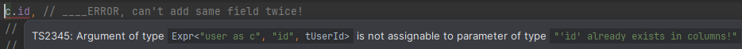
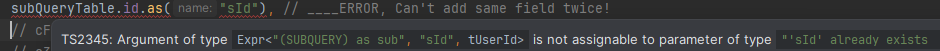
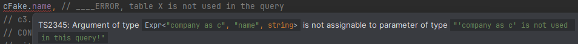
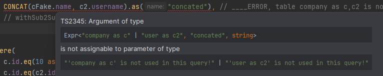
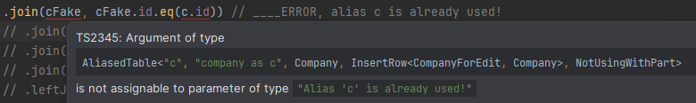
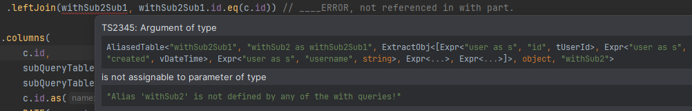
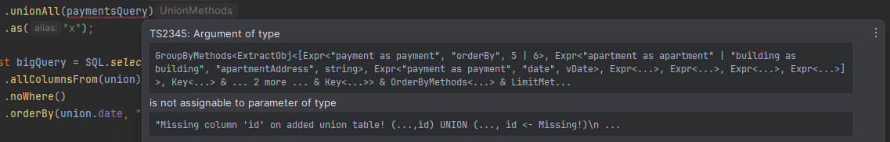
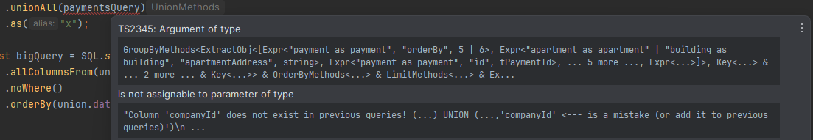

# Typescript Mysql query builder

Powerful SQL query builder with lots of compile time errors to hint what is wrong. Some examples include:

* Fully type checked, it is very hard to use wrong property names or types.
* Fully checks that all used tables are actually part of the query.
* Protects against duplicate alias usage.

In short - no more SQL syntax errors even when testing, only logic errors are left for the developer to figure out :)

In addition

* Good support for refactoring. If you happen to rename a field, you can rename it in the whole codebase with a single go.
* Very similar to actual SQL including MySQL functions like DATE(c.created), NOW(), and so on.
* Heavily optimized for readability
* Free to use any mysql library to connect to database. This library is only for SQL query building.

# Basic example

This library does not execute queries, it only prepares SQL statements.

```typescript
// Your custom query execution function. (libraries: mysql or mysql2 usually)
function execute<Result>(query: SqlQuery<Result>): Promise<Result[]> {
    const sqlString = query.toSqlString();
    // Execute your query... 
}

const rows = await execute(SQL
    .selectFrom(tUser)
    .columns(
        tUser.id,
        tUser.firstName,
        COUNT(tUser.firstName).as("count"),
        DATE(MAX(tUser.created)).as("lastCreatedDate")
    )
    .where(tUser.isActive.eq(1))
    .groupBy(tUser.firstName)
    .having(COUNT(tUser.firstName).eq(3))
    .orderBy(tUser.firstName)
    .limit(20))

// Resulting type is
const res: {
    id: number,
    firstName: string,
    count: number,
    lastCreatedDate: string
} = undefined

```

# Error checking

As typescript errors can be sometimes cryptic for complex cases, there are lots of simplified errors used by this library to make understanding where the issue is easier.

----
Can't add columns with same name multiple times to the query

1. 

2. 

----
If table is not added to the query via from, join etc...

1. 

2. 

----
Alias is already used, can't have duplicate aliases.

1. 

----
Table joined is not defined in the with part of the query (WITH ... SELECT ...)

1. 

----

Union erros, when added table has more or less fields than expected.

1. 

2. 

----

# SELECT

## Using as a gateway

```typescript
MyDb.user.select("username")
    .where({id: 10})
    .toSqlString();

MyDb.user.select("id", "username")
    .where({birthYear: 1986})
    .orderBy("username", "asc", "id")
    .limit([10, 10])
    .toSqlString();
```

## Uses "result columns" in HAVING and ORDER BY clauses.

```typescript
SQL
    .selectFrom(tUser)
    .columns(
        tUser.firstName.as("username2"),
        COUNT(tUser.firstName).as("count")
    )
    .where(tUser.isMan.eq(1))
    .groupBy(tUser.firstName)
    .havingF((r) => [r.count.compare(">", 1)]) // Via argument 'r' you can access properties defined in columns.
    .orderByF((r) => [r.count, "desc"]) // Via argument 'r' you can access properties defined in columns.
    .toSqlString()
```

## Special methods to select columns.

```typescript
SQL
    .selectFrom(tUser)
    .one() // 1 as one
    .where(tUser.isMan.eq(1))
    .toSqlString()

SQL
    .selectFrom(tUser)
    .allColumnsFrom(tUser)
    .where(tUser.isMan.eq(1))
    .toSqlString()
```

## Using subqueries

```typescript
// Scalar subquery is used to return single value as a column.
const scalarSub = SQL
    .uses(tUser)
    .selectFrom(tArticle)
    .columns(MAX(tArticle.created))
    .where(tUser.createdBy.eq(10))
    .asScalar("subColumn");

const joinSub = SQL
    .uses(tUser)
    .selectFrom(tArticle)
    .columns(tArticle.title, tArticle.createdBy)
    .noLimit()
    .as("joinSub")

const query = SQL
    .selectFrom(tUser)
    .join(joinSub, joinSub.createdBy.eq(tUser.id))
    .columns(
        tUser.id.as("userId"),
        joinSub.title.as("articleTitle"),
        joinSub.createdBy.as("articleCreatedBy"),
        scalarSub.as("lastArticleCreated"),
    )
    .where(tUser.firstName.startsWith("Oliver"))
    .toSqlString()
```

## Using with

```typescript
const sub = SQL.selectFrom(c)
    .columns(
        tUser.id,
        tUser.created,
        RANK().over(f => f.partitionBy(tUser.age).orderBy(tUser.created, "desc")).as("latest"),
    )
    .where(tUser.keyCheck.in([1, 2, 3, 4] as tUserId[]))
    .as("sorted")

// Queries always use alias, in this case we need to give an alias to a query defined in the WITH part.
const ref = SQL.createRef(sub, "tbl")

const query = SQL
    .with(sub)
    .selectFrom(ref)
    .window("win", w => w.partitionBy(sub.created))
    .columns(
        ref.id,
        BIN_TO_UUID(ref.id).as("uuid"),
        UNIX_TIMESTAMP(ref.created),
        RANK().over("win", w => w.orderBy(sub.created))
    )
    .where(ref.latest.eq(1))
    .orderBy(ref.created_at, "desc")
```

## Prepared select queries

If performance matters so much that you really want to skip constructing the SQL query.
This creates an execution function that has query cached and it only needs to set variable values.
It does not support any dynamic construction though, only replacing variables!
(It is not Mysql prepared query, it is just a string that is prepared and cached!)

```typescript
interface Args {
    userId: number
}

// This is your implementation of sending the query to database.
// This library does not connect to database directly.
const exec = (query: string): any[] => {
    // Send query to databse.
}

const preparedQuery = SQL.prepare((args: Args) => {
    return SQL
        .selectFrom(tUser)
        .columns(tUser.id, c.username)
        .where(tUser.id.eq(args.id))
        .noLimit()
})

const oftenCalled = async () => {
    const query = preparedQuery({id: 10}).toSqlString();
}
```

# INSERT

## Using as gateway

```typescript
MyDb.user.insert({username: "Oliver", birthYear: "1986"});
```

## Using as query

```typescript
const row = {username: "Oliver", birthYear: "1986"};

SQL.insertInto(tUser).set(row).toSqlString()

SQL.insertInto(tUser).values([row, row]).toSqlString()

SQL.insertIgnoreInto(tUser).select(SQL
    .selectFrom(tUser)
    .columns(tUser.username, tUser.birthYear)
    .where(tUser.birthYear.eq(1986))
    .as("sub")
).toSqlString()
```

# UPDATE

## Using as gateway

```typescript
MyDb.user
    .update({username: "Oliver", birthYear: 1986})
    .where({birthYear: 1980})
    .orderBy("id")
    .limit(10)
    .toSqlString()
```

## Using as query

```typescript
SQL.update(tUser)
    .set({
        firstName: input.firstName
    })
    .where(tUser.id.eq(input.userId))
    .toSqlString()
```

## Using as query and subquery

```typescript
const sub = SQL
    .selectFrom(tArticle)
    .columns(
        tArticle.userId,
        MAX(tArticle.created).as("lastArticle")
    )
    .groupBy(tArticle.userId)
    .as("sub")

const q3 = SQL
    .update(tUser)
    .join(sub, sub.userId.eq(tUser.id))
    .set({
        lastArticle: sub.lastArticle
    })
    .toSqlString()

```

# DELETE

## Using as gateway

```typescript
MyDb.user.deleteWhere({id: input.userId}).toSqlString();
```

## Using as query

```typescript
SQL
    .deleteFrom(tUser)
    .where(tUser.id.eq(input.userId))
    .orderBy(tUser.id)
    .limit(10)
    .toSqlString()
```

# Functions

Mostly MYSQL functions, but there are some special ones.

### Comparison

* (special) VALUE(ARG) - any value you want to exist in the query.
* (special) NULL<type>() - If you need a dummy placeholder value in the query.
* (special) ONE() - Just "1 as one" to simplify certain queries.
* OR( bool_expr, ...)
* AND( bool_expr, ... )
* NOT( bool_expr )
* IF( bool_expr, expr | value, expr | value )
* IFNULL( expr | value, expr | value )
* IS_NULL( expr )
* NOT_NULL( expr )
* IN( expr | array )
* EQ( expr | value, expr | value )
* COMPARE( expr | value, operator, expr | value)
* LIKE( expr )
* EXISTS( expr )
* NOT_EXISTS( expr )
* (special) CONTAINS( expr ) - LIKE %value%
* (special) STARTS_WITH( expr ) - LIKE value%
* (special) ENDS_WITH( expr ) - LIKE %value

### String

* TRIM( expr )
* CONCAT( expr | value, ...)
* CONCAT_WS( separator, expr | value, ...)
* GROUP_CONCAT( f => f.all(c.id).orderBy(expr).separator(",") )

### Date

* NOW()
* CUR_DATE()
* YEAR( expr )
* UNIX_TIMESTAMP( expr )
* DATE( expr )
* DATE_TIME( expr )
* DATE_FORMAT( expr )
* DATEDIFF( expr1 | date, expr2 | date )
* DATE_ADD( expr, amount, unit )
* DATE_SUB( expr, amount, unit )

### Numbers

* MATH("? + ?", [expr1, expr2, ...]) // Can only contain numbers and math operators. No letters of any kind.
* ABS( expr )
* CEIL( expr )
* FLOOR( expr )
* ROUND( expr )
* SIGN( expr )
* SQRT( expr )

### Aggregate

Aggregate functions have an additional method .over( f => f.partitionBy( expr, ... ).orderBy( expr, "asc" | "desc", ... ))

* MIN( expr )
* MAX( expr )
* SUM( expr )
* COUNT( expr )
* RANK()
* ROW_NUMBER()
* LAG( expr )
* LEAD( expr )
* FIRST_VALUE( expr )
* LAST_VALUE( expr )
* NTH_VALUE( expr )

### Misc

* BIN_TO_UUID( expr )

## Creating your own functions

1. Make a pull request to get new MySQL compatible functions to get merged
2. If you don't really want to....

Most functions are single liners. Complexity is in handling the types, not really the execution part.

```typescript
// Functions track 3 types: 
// TableRef - what tables have been used "user as a" | "article as a"
// Name - name of the field used. (will be used in 'field as $Name')
// Type - type of the field.
export function DATE<Name, TableRef>(field: Expr<TableRef, Name, vDate | vDateTime>): Expr<TableRef, Name, vDate> {
    return SqlExpression.create("DATE(" + field.expression + ")")
}

// Comparison function should have SQL_BOOL (1 | 0) as type.
export function IS_NULL<TableRef, Name, Type extends string | number>(col: Expr<TableRef, Name, Type>): Expr<TableRef, Name, SQL_BOOL> {
    return SqlExpression.create(col.expression + " IS NULL")
}
```

# Getting started

To use the library these kinds of structure need to be created (read: generated).
Mysql schema parser and generator for these particular cases are added to this library.

```typescript
const data = runQuery(MysqlTableStructureParser.getSchemaRowsQuery("my_database_name"))
const parsed = MysqlTableStructureParser.parse(data);
CodeGenerator.generateAllToSingleFile(parsed, "./out/dir/");
// or
CodeGenerator.generateCustomTypesSupportedFiles(parsed, "./out/dir/");
```

## Simple approach

Just generate and keep regenerating everything. Positive is that this approach is very simple
Negative is that you can't use custom types, only library supported ones: number | string | vDate | vDateTime

```typescript
export class MyDb {

    public static user = new MysqlTable<"user", UserRow, UserRowForInsert>("user", {
        id: {type: ColumnDataType.INT},
        username: {type: ColumnDataType.VARCHAR},
    })
}

// This is precise structure of the row, ideal for SELECT queries.
export interface UserRow {
    id: number;
    created_at: vDateTime,
    username: string;
}

// This interface is only used internally to understand database structure better. (for example id column is not something you usually set for insert calls).
export interface UserRowForInsert {
    username: unknown;
}
```

Convenience access constants

```typescript
const tUser = MyDb.user.as("user");
const tArticle = MyDb.article.as("article");
```

## 'I want custom types' approach (recommended):

1) Generate Row interfaces. We generate these files only once!
   Later errors are discovered during compile time when other files are regenerated

```typescript

export type tUserId = number & { tUserId: true };

export interface UserRow {
    id: tUserId;
    created_at: vDateTime,
    username: string;
}
```

2) Generate Database structure file and "xxxRowForEdit" interfaces into a single file.
   We keep regenerating these files in case database structure changes.

```typescript
export class MyDb {

    public static user = new MysqlTable<"user", UserRow, UserRowForInsert>("user", {
        id: {type: ColumnDataType.INT},
        username: {type: ColumnDataType.VARCHAR},
    })
}

export interface UserRowForInsert {
    username: unknown;
}
```


